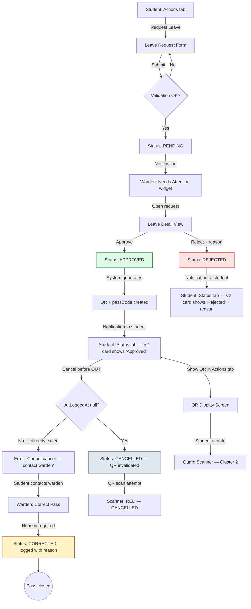
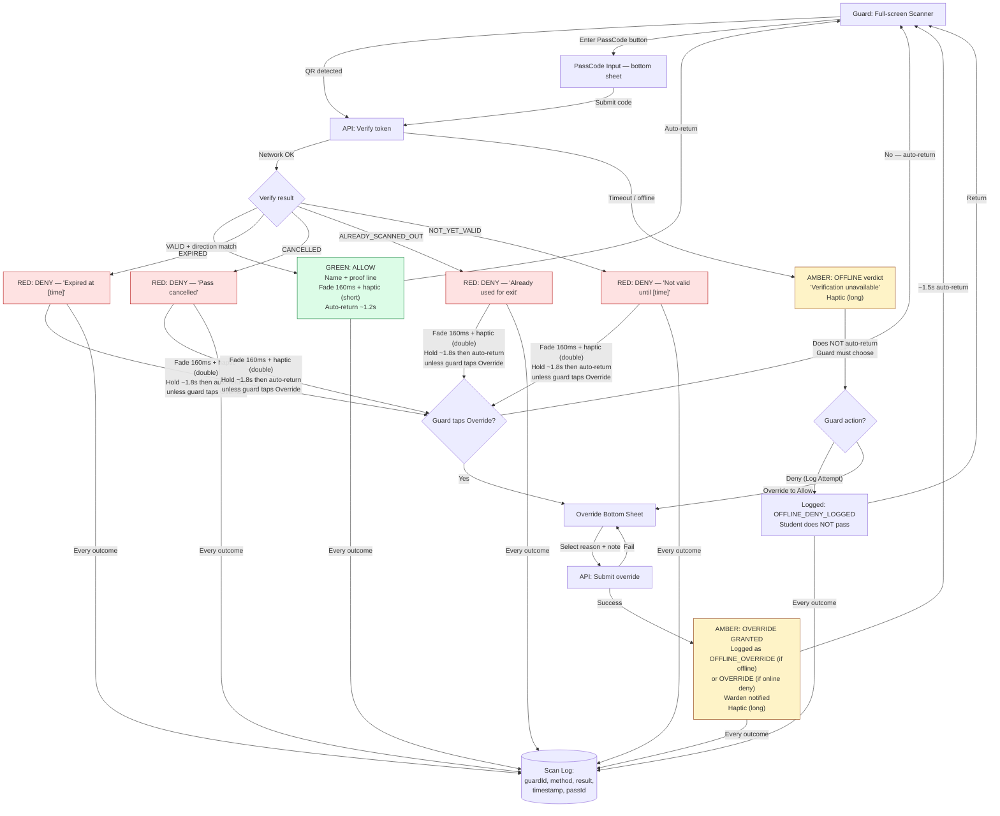
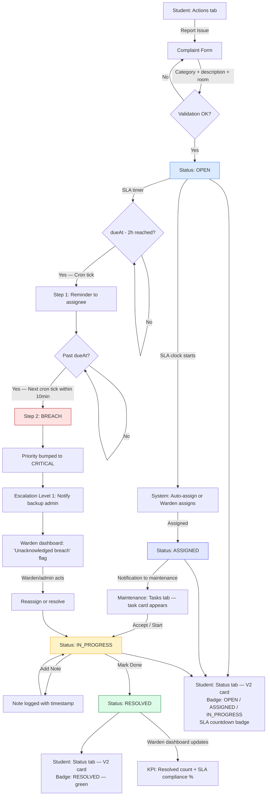
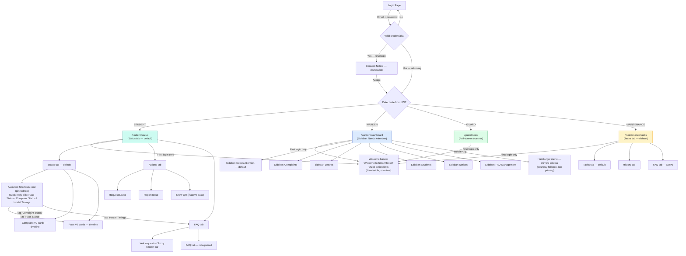

# UX Design Specification SmartHostel

**Author:** sayuj
**Date:** 2026-03-02

---

## Executive Summary

### Project Vision

SmartHostel replaces informal, trust-based hostel processes — WhatsApp approvals, paper registers, verbal follow-ups — with three integrated pillars of verifiable, time-bound, self-service workflows:

1. **Cryptographic QR Gate Passes** — Signed, time-bound passes with instant green/red verification. The guard makes zero judgment calls; the system decides.
2. **SLA-Driven Complaint Automation** — Category-based deadlines with automated reminders and two-step escalation. Accountability is systemic, not personal.
3. **Self-Service Chat Assistant** — Quick-reply status shortcuts + fuzzy FAQ search. Deflects repetitive queries before they reach the warden.

The system property these create together is **provable, low-dispute operations** — where every gate scan, complaint action, escalation, and override is attributed, timestamped, and surfaceable on demand. The UX must make this provability feel effortless and trustworthy, not bureaucratic.

**Stack:** MERN + Tailwind CSS | **Scale:** ~300 students, ~10-20 staff, single hostel | **Timeline:** 3-4 week MVP

### Target Users

Four roles with fundamentally different devices, contexts, and UX needs:

| Role | Archetype | Device / Context | Core UX Need |
|------|-----------|-----------------|--------------|
| **Student** | Rahul (typical resident), Aisha (first-year, needs scaffolding), Karan (final-year, needs speed) | Mobile Android/iOS, campus Wi-Fi | Transparency + progress visibility + self-service speed |
| **Warden/Admin** | Dr. Priya (faculty warden, hybrid role, time-poor) | Desktop/laptop primary | Exception-based dashboard + audit trail access + batch actions |
| **Guard** | Suresh (contract security, shift-based, rush hour pressure) | Low-end Android, outdoor, poor connectivity | Binary green/red decision in <3 seconds + proof line + no blame |
| **Maintenance** | Ravi (small specialized team: electrician, plumber, handyman) | Basic Android, on-site use | Clear priority queue + simple accept/progress/resolve with notes |

**Independence spectrum:** Aisha needs optional scaffolding (templates, hints, defaults, "what to do next" suggestions) while Karan needs zero friction. The UI uses progressive disclosure — scaffolding is available but never forced. No mandatory tutorials; the fast path is always accessible.

### Key Design Challenges

1. **Extreme device/context spectrum** — Same app must serve a warden on desktop managing data-heavy dashboards AND a guard scanning QR codes one-handed outdoors on a budget Android in bright sunlight during rush hour. The guard scanner page is the most performance-sensitive and UX-critical surface in the entire system.

2. **Trust through transparency, not surveillance** — The product thesis is "provable operations." UX must make audit trails, SLA countdowns, and status timelines feel like reassurance ("the system is tracking this for me"), not monitoring. Student-facing pages should default to **timeline + what happens next** rather than forms — students care most about progress, not data entry.

3. **Binary gate decisions with proof** — The guard result screen must show only what's needed to decide (green/red + student name + pass type + window) plus a single proof line ("Verified online" / "Offline — logged for review"). Extra details slow decisions and create confusion during rush hour.

4. **Gate direction clarity** — UX must explicitly support SCAN OUT vs. SCAN IN as distinct actions (toggle or auto-detect based on pass status), because direction affects state transitions, override rules, and present-count accuracy.

5. **Offline mode must be visually unambiguous** — When network verification fails and falls back to offline logging, the UI must never resemble a normal "VALID" success. A distinct visual state is required: different color scheme, explicit "OFFLINE — Logged for review" label, and clear indication that the entry is queued for reconciliation. The guard must always know whether a verification was confirmed or deferred.

6. **Alert fatigue prevention through bundling** — Notifications route to 4 roles with different urgency levels. UX must support grouped notifications ("3 complaints nearing SLA breach") with clear action CTAs rather than 1 notification per event when many occur in a short window. Reminders go to the responsible actor only; escalations go to the warden.

7. **First-year help as optional scaffolding** — Templates, hints, and smart defaults provide guidance without forcing tutorials. Progressive disclosure keeps the fast path (Karan mode) always available. The chat assistant serves as a natural entry point for confused users while experienced users navigate directly.

### Design Opportunities

1. **"3-Second Gate" as a signature moment** — The scan-to-result flow is the defining UX moment of the entire product. Precise timing targets:
   - Camera opens immediately (skeleton UI + permission prompt handling for first use)
   - Scan-to-result: ≤ 3 seconds end-to-end
   - Result stays on screen ~1-1.5 seconds (enough to read, not enough to stall the queue)
   - Auto-returns to scanning (no manual "next" tap)
   - One-tap "Override" button appears only on denial + guard role — never on success screens
   - If this feels instant and decisive, it sells the entire system.

2. **Exception-based warden dashboard** — "Needs attention now" is the first and default section: pending leave approvals, near-breach complaints, breached complaints, overrides pending review, cron health status. Everything else lives in tabs/filters. This respects Dr. Priya's limited time window and makes the system feel intelligent rather than overwhelming.

3. **Status as reassurance** — SLA countdown badges, notification timelines, assignment confirmations, and "your complaint was assigned 2 hours ago" messages transform the student experience from "nobody cares" to "the system is tracking this for me." Complaint and leave pages default to the status timeline view, with the creation form as the entry step.

4. **Progressive disclosure across the independence spectrum** — First-year students see reason templates, category hints, and "what to do next" suggestions. Final-year students see streamlined flows with minimal friction. The same UI serves both — scaffolding elements are present but non-blocking.

## Core User Experience

### Defining Experience

SmartHostel's UX is defined by four interlocking role-specific core loops, each optimized for a different device, context, and cognitive mode:

| Core Loop | Role | Frequency | Cognitive Mode | Success Feel |
|-----------|------|-----------|---------------|--------------|
| **3-Second Gate Scan** | Guard | 50+/hour (rush) | Reactive, binary | "System decides, I execute" |
| **Status Timeline Check** | Student | Several/day | Glance, reassurance | "The system is tracking this for me" |
| **SLA Complaint Lifecycle** | Maintenance + Warden | Continuous background | Task queue, exception alerts | "Nothing falls through the cracks" |
| **Exception Dashboard** | Warden | 1-2x/day, 5-10 min | Triage, batch action | "I see only what needs me" |

**The signature interaction is the guard gate scan.** If this feels instant and decisive, it validates the entire system. Every other flow builds credibility on top of this foundation.

### Platform Strategy

**Responsive web SPA (no native app)**, role-aware breakpoints:

| Surface | Primary Platform | Input Mode | Key Constraint |
|---------|-----------------|------------|----------------|
| Guard scanner | Mobile (low-end Android) | Touch, one-handed, outdoor | Camera API (HTTPS required), poor connectivity, bright sunlight, rush-hour throughput |
| Student pages | Mobile (Android/iOS) | Touch, thumb-zone | Campus Wi-Fi variability, QR display must render clearly at scanning distance |
| Warden dashboard | Desktop/laptop | Mouse + keyboard | Multi-column data density, batch operations, data tables with filtering |
| Maintenance queue | Mobile (basic Android) | Touch, on-site | Simple list → detail, minimal typing, large form fields |

**Breakpoints (Tailwind standard):** Mobile < 640px (guard, student, maintenance primary) · Tablet 640-1024px (warden acceptable) · Desktop ≥ 1024px (warden primary)

**Offline strategy:** No service worker for MVP. Scanner page handles API timeouts gracefully with strict deny behavior. **Offline verification = strict deny.** The system never silently approves an unverified scan. If the network is down, the guard must use Override to allow passage (reason + note required, logged for warden review). Static assets cached via standard React production build.

### Internal Codes → UI Copy Mapping

Internal API enums are the shared constants across frontend, backend, and this spec. The UI renders human-readable copy. This table is the canonical mapping:

| Internal Enum (API/Constants) | UI Copy (Guard Sees) | Color |
|-------------------------------|---------------------|-------|
| `VALID` | "VALID — {Student Name}" | Green |
| `EXPIRED` | "EXPIRED — {Student Name}" | Red |
| `CANCELLED` | "CANCELLED — {Student Name}" | Red |
| `ALREADY_SCANNED_OUT` | "ALREADY USED — {Student Name}" | Red |
| `ALREADY_SCANNED_IN` | "ALREADY RETURNED — {Student Name}" | Red |
| `NOT_YET_VALID` | "NOT YET VALID — {Student Name}" | Red |
| `INVALID_SIGNATURE` | "INVALID QR" | Red |
| `NOT_FOUND` | "UNKNOWN PASS" | Red |
| `NETWORK_UNVERIFIED` | "OFFLINE — Cannot Verify" | Amber |

Developers use the left column in code. Designers and copy use the right column. No renaming of enums — only the display layer maps them.

### Critical Flows — States, Errors, and Copy

#### Flow 1: Guard Scanner (3-Second Gate)

**Guard shift panel (top-right, always visible):**
- Guard name + shift start time
- Sync status: "Last sync: {time}" / "Offline mode" (amber dot)
- Shift counters: "{N} scans · {N} overrides this shift"

**Direction handling — Auto mode (default, locked):**
- Server determines EXIT vs ENTRY based on leave status + last scan direction.
- UI displays current detection: "Auto: EXIT" / "Auto: ENTRY"
- **Manual override requires long-press (600ms) on direction label + confirm prompt:** "Manual EXIT for next scan only?" — prevents accidental toggling during rush hour.
- **Auto-resets after 1 scan** — manual direction never silently persists. After the overridden scan completes, direction reverts to Auto.

**Direction audit fields (backend — every scan record must include):**
- `directionDetected`: `ENTRY` | `EXIT` — what the server auto-detected based on leave status + last gate state
- `directionUsed`: `ENTRY` | `EXIT` — the direction actually applied (same as detected unless manually overridden)
- `directionSource`: `AUTO` | `MANUAL_ONE_SHOT` — whether guard manually overrode direction for this scan
- `lastGateStateBeforeScan`: `IN` | `OUT` | `UNKNOWN` — the student's gate state immediately prior to this scan (for audit reconstruction)

**Micro-flow sequence:**

1. **Scanner ready** — Camera active, viewfinder with scan target overlay. Direction indicator: "Auto: EXIT" / "Auto: ENTRY". Shift panel visible top-right.
2. **Scanning** — QR detected, verifying... (brief pulse animation, <500ms server-side target).
3. **Result** — Full-screen verdict with **large "ALLOW" or "DENY" word at top** (readable in glare + accessible for color-blind users). Held ~1-1.5s, then auto-returns to scanning. **Haptic feedback:** vibration pulse on result (if device supports; short buzz for ALLOW, double buzz for DENY). Optional audible beep toggle in guard settings.

**Scanner timeout thresholds (prevents hanging spinner):**
- Verify call > **1.5s** → show "Still verifying..." (keeps guard calm, indicates progress)
- Verify call > **3.0s** → switch to `NETWORK_UNVERIFIED` → amber "OFFLINE — Cannot Verify" (strict deny rule applies)
- Both thresholds logged: `latencyMs`, `timeoutTriggered: true/false`

**Result states and copy:**

| State | Color | Primary Text | Proof Line | Action |
|-------|-------|-------------|------------|--------|
| `VALID` | **Green** | "ALLOW — {Student Name}" | "{Leave Type} · Return by {time} · Verified online" | None (auto-return) |
| `EXPIRED` | **Red** | "DENY — {Student Name}" | "Pass expired at {time}" | [Override] |
| `CANCELLED` | **Red** | "DENY — {Student Name}" | "Cancelled by student at {time}" | [Override] |
| `ALREADY_SCANNED_OUT` | **Red** | "DENY — {Student Name}" | "Exit logged at {time}" | [Override] |
| `ALREADY_SCANNED_IN` | **Red** | "DENY — {Student Name}" | "Entry logged at {time}" | [Override] |
| `NOT_YET_VALID` | **Red** | "DENY — {Student Name}" | "Pass valid from {time}" | [Override] |
| `INVALID_SIGNATURE` | **Red** | "DENY — INVALID QR" | "Could not verify code" | [Override] |
| `NOT_FOUND` | **Red** | "DENY — UNKNOWN PASS" | "No matching pass found" | [Override] |
| `NETWORK_UNVERIFIED` | **Amber** | "OFFLINE — Cannot Verify" | "Network unavailable · Override to allow" | [Override] (only path) |

**Note:** `ALREADY_COMPLETED` is not a separate guard-visible state. The lifecycle auto-transitions `SCANNED_IN → COMPLETED` immediately, so the guard always encounters `ALREADY_SCANNED_IN` when scanning an already-returned student.

**Offline behavior (strict deny):**
- When the verify API exceeds the 3.0s timeout or returns a network error, the screen shows amber "OFFLINE — Cannot Verify."
- The guard **cannot** let the student pass without triggering Override.
- Override in offline context follows the same sub-flow (reason + note), but is tagged `method: OFFLINE_OVERRIDE` in the log.
- When connectivity returns, offline override logs sync and appear in the warden's review queue as "offline overrides pending review."
- This matches the PRD invariant: "offline entries MUST reconcile to explicit success/fail."

**Override sub-flow (appears only on denial/offline + guard role):**
1. Guard taps [Override]
2. Select reason: Medical Emergency / Family Emergency / Staff Instruction / Other
3. **Note field prefilled with template based on reason:**
   - Medical Emergency → "Medical emergency — allowed {EXIT/ENTRY} at {time}"
   - Family Emergency → "Family emergency — allowed {EXIT/ENTRY} at {time}"
   - Staff Instruction → "Staff instruction from {name} — allowed {EXIT/ENTRY} at {time}"
   - Other → (blank, guard types from scratch)
   - Guard can edit prefilled text. Minimum 5 characters required.
4. Confirm → logged with guard ID + timestamp + method (`MANUAL_OVERRIDE` or `OFFLINE_OVERRIDE`) → warden notified immediately
5. Returns to scanning

**Error/edge states:**
- **Camera permission denied:** Scanner hidden, passCode input shown as primary: "Camera not available — verify by passCode"
- **Camera glare/unreadable:** After 5s without successful decode, subtle prompt: "Having trouble? [Enter PassCode manually]"
- **PassCode fallback:** Large input field, numeric keyboard hint, rate-limited (5 attempts/min/guard, lockout after N failures for 10 min). Same ALLOW/DENY result screen on verify.
- **PassCode locked out:** "Too many attempts — wait {minutes} or contact admin"

#### Flow 2: Leave Request + QR Pass

**Student flow:**
1. **My Leaves (default: status timeline)** — Active/recent leaves as status cards with badges. "Request Leave" button prominent but secondary to status view.
2. **Create leave** — Type selector (Day Outing / Overnight), calendar date picker, reason template dropdown + optional custom text. Target: <60s.
3. **Pending** — Badge: "Pending Approval" + submitted timestamp.
4. **Approved — QR Pass view:**
   - QR code displayed at minimum 250×250px (or 60% of screen width, whichever is larger) for reliable scanning at ~15cm distance
   - **Brightness hint:** "Turn brightness to max for best scanning" (dismissible, shown once)
   - **Keep screen awake:** Uses Wake Lock API when available to prevent phone sleeping at gate; otherwise shows hint: "Keep your screen active while at the gate"
   - PassCode shown below QR as fallback text
   - Leave window + return time visible
   - Status: "Approved — QR Pass Ready"
5. **Out** — "Out since {time}. Return by {time}." QR still visible for return scan.
6. **Completed** — "Completed — {out time} to {in time}." Archived.
7. **Rejected** — "Rejected by {warden name}" with reason if provided.
8. **Cancelled** — "Cancelled by you at {time}." Only available pre-exit.

**Empty/error states:**
- **No leaves yet:** "No leave history. [Request Leave] to get started."
- **Cancel after exit:** "Cannot cancel — you've already exited. Contact your warden for corrections."
- **QR won't render:** PassCode shown prominently: "Show this code to the guard: {passCode}"

#### Flow 3: Complaint Timeline + SLA

**Student view (timeline-first):**
1. **My Complaints (default: active timeline)** — Each complaint shows: category icon, title, **SLA countdown badge** ("Due in 18h" / "Overdue 3h"), current status, last update timestamp, **ownership line: "Owner: {name} ({role}) · Next check: {time} · Due: {time}"**
2. **Complaint detail** — Full timeline: Created → Assigned → In Progress → [current]. Each entry shows actor + timestamp. Ownership line always visible at top. SLA badge prominent.
3. **Create complaint** — Category dropdown (auto-sets priority + SLA), description, optional photo. Hint for first-timers: "Select the category that best matches your issue — this sets the response priority."

**Ownership line (always visible on complaint cards and detail):**
- Unassigned: "Owner: Waiting for assignment · Due: {time}"
- Assigned: "Owner: Ravi (Maintenance) · Next check: {time} · Due: {time}"
- Escalated: "Owner: Ravi (Maintenance) · ESCALATED to warden · Overdue {hours}h"
- Resolved: "Resolved by Ravi: {notes preview}"

**SLA copy (system-generated timeline entries):**
- Assignment: "Assigned to {staff name} by {warden name}"
- Reminder: "Reminder sent to {staff name} — SLA due in {hours}h"
- Escalation: "Escalated — priority raised to CRITICAL. {Warden/backup} notified."
- Breach persisting: "SLA breached {hours}h ago — awaiting action"
- Resolution: "Resolved by {staff name}: {resolution notes}"

**Empty/error states:**
- **No complaints:** "No complaints filed. [Report an Issue] if something needs fixing."
- **Status query fails (assistant):** "I'm having trouble checking your status right now. Try again in a moment."
- **Photo upload fails:** "Photo couldn't be uploaded. Submit without it and add details later."

#### Flow 4: Warden Exception Dashboard

**Default view — "Needs Attention Now" (first section, always visible):**

| Widget | Content | Visual Treatment |
|--------|---------|-----------------|
| **Pending Approvals** | Count of pending leave requests | Badge with count, tap to view queue |
| **Near-Breach Complaints** | SLA due in <6h | Amber warning cards with countdown |
| **Breached Complaints** | Past SLA deadline | Red alert cards, "overdue by {time}" |
| **Overrides Pending Review** | Today's guard overrides | Orange cards with reason preview |
| **System Health** | Cron status + scan failures + offline backlog | Green/amber/red indicator |

**System health widget copy:**
- Healthy: "All systems operational — last cron: {time} (SUCCESS)"
- Cron unhealthy: "SLA automation unhealthy — last success {time ago}. Reminders and escalations may be stalled."
- Scan failures: "{N} scan failures today"
- Offline backlog: "{N} offline overrides pending review"
- Override spike: "Override rate above threshold ({N} today / {N} this hour)"

**Override threshold defaults (MVP):**
- Spike alert triggers at: **>5 overrides/day** OR **>3 overrides/hour**
- Displayed as: "Override rate above threshold ({N} today / {N} this hour)" on health widget
- Thresholds are warden-configurable in settings (post-MVP: editable per-guard or per-shift)

**Override review card (warden view):**
Each override in the review queue shows: student name, scan time, reason category, guard note, guard name, scan method (`MANUAL_OVERRIDE` / `OFFLINE_OVERRIDE`), correlationId. Single action: **[Mark Reviewed]** — adds warden attribution + timestamp, removes from pending queue.

**Tabs/secondary sections:** All complaints (filtered), all leaves (filtered), student list, notices, fee management, settings.

**Empty states:**
- **Nothing needs attention:** "All clear — no pending items or alerts right now."
- **Loading:** Skeleton cards with shimmer animation.
- **API error:** "Dashboard data couldn't be loaded. [Retry]"

### Self-Service Assistant (Structured Cards, Not Chat)

**Hard rule:** The assistant is a structured query interface, not a conversational chatbot. Responses are always rendered as **status cards**, never chat-style paragraphs. This keeps it fast, predictable, and prevents scope creep.

**Layout:**
- Quick-action buttons at top: "My Complaints" / "My Leaves" / "Fee Status" / "Ask a Question"
- Tapping a status button returns a **card list** (top 3 items + "View all →" link), not a text response.
- Each card mirrors the status card format from the main pages (status badge, countdown, ownership line).
- "Ask a Question" triggers fuzzy FAQ search with results as cards (title + answer preview + "Read more").

**Example — "My Complaints" response:**
```
┌─────────────────────────────────┐
│ 🔧 Ceiling fan not working       │
│ IN PROGRESS · Due in 18h         │
│ Owner: Ravi (Maintenance)        │
│ [View Details →]                 │
├─────────────────────────────────┤
│ 🚿 Bathroom tap leaking          │
│ ASSIGNED · Due in 6h             │
│ Owner: Sunil (Maintenance)       │
│ [View Details →]                 │
├─────────────────────────────────┤
│ View all complaints (3) →        │
└─────────────────────────────────┘
```

**Edge states:**
- No active items: "No active complaints. [Report an Issue]"
- API failure: "Couldn't load status. [Retry] or check the main page."
- FAQ no match: "No matching answer found. Try rephrasing or contact your warden."

### Effortless Interactions

**What should require zero thought:**
- Guard scans QR → ALLOW/DENY → auto-return → next student. No interpretation, no register, no phone call.
- Student opens app → sees complaint/leave status with countdown + owner. No office visit.
- Warden opens dashboard → sees only exceptions. No scrolling through resolved items.
- Maintenance opens queue → tasks sorted by priority. No verbal instructions.

**What should happen automatically:**
- SLA deadline computed from category at creation
- Direction (EXIT/ENTRY) auto-detected from pass status + last scan
- Reminders sent 2h before breach
- Escalation fires on breach
- QR token generated on approval
- Gate log written on every scan attempt (including timeouts)
- Present count derived from latest gate status per student
- Override spike alerts when threshold exceeded
- Manual direction auto-resets to Auto after 1 scan

### Critical Success Moments

| Moment | Role | What Happens | What It Replaces |
|--------|------|-------------|-----------------|
| **First 3-second scan** | Guard | Scan → green ALLOW + vibration → auto-return → next student | 30s register lookup + screenshot debate |
| **First SLA notification** | Student | "Assigned to Ravi. Due in 24h" + ownership line | Silence + repeated office visits |
| **First audit trail pull** | Warden | Parent calls → one-tap timeline → exact history | "I think we handled it..." |
| **First breach prevented** | Warden | Dashboard shows near-breach → acts before escalation | Silent failure + angry student days later |
| **First card from assistant** | Student | Tap "My Complaints" → instant card with countdown + owner | Walk to warden's office for "any update?" |

### Experience Principles

1. **Binary decisions, not judgment calls** — Every interaction has a clear, system-determined outcome. ALLOW or DENY. Due or overdue. Assigned or unassigned.
2. **Timeline first, forms second** — Default views show progress and "what happens next." Creation flows are the entry step, not the default state.
3. **Exceptions surface, normal hides** — Dashboards and alerts show only deviations. Calm when on track, unmissable when not.
4. **Proof is always one tap away** — Every action has an attributed, timestamped audit trail accessible from any relevant screen.
5. **Fast path always available** — Scaffolding helps new users but never blocks experienced users. Every flow has "Karan mode."
6. **Offline is a visible state, never a hidden failure** — Unverified = amber, never green. Override is the only path through offline.
7. **Ownership is always answered** — Every complaint, every leave, every scan shows who owns it now and what happens next.

## Desired Emotional Response

### Primary Emotional Goals (Per Role)

| Role | Emotional Shift (FROM → TO) | Primary Feeling | What Triggers It |
|------|---------------------------|----------------|-----------------|
| **Guard** | Blame → Protection | **Relief** — "I can't get this wrong" | Green/red verdict removes judgment calls; every action logged for his protection too |
| **Student** | Helplessness → Agency | **Reassurance** — "The system is tracking this for me" | Countdown badges, ownership lines, timeline entries that prove progress |
| **Warden** | Firefighting → Control | **Confidence** — "I can prove what happened" | Exception dashboard, one-tap audit trails, evidence ready when parents call |
| **Maintenance** | Invisibility → Recognition | **Clarity** — "I know exactly what to do and my work is visible" | Priority queue replaces verbal instructions; resolution notes prove completion |

**North star emotion across all roles: Certainty.** Every user, in every interaction, should feel certain about what the system decided, what happened, and what comes next. Ambiguity is the enemy.

**Guard protection framing:** Logs exist to protect guards from disputes (who/when/what) — not to punish. Override review is informational unless patterns persist. The warden action is "Mark Reviewed," not "Approve/Reject Override."

### Certainty Checklist (Every Screen Must Pass)

Every page in SmartHostel must answer three questions within <2 seconds of loading:

1. **Status** — What is it right now? (badge, color, state label)
2. **Owner** — Who is responsible now? (name, role, or "waiting for assignment")
3. **Next** — What happens next + when? (countdown, next action hint, or "all clear")

If any screen can't answer all three, it's not on-brand. This is the implementable form of "certainty as the north star."

### Emotional Journey Mapping

**First encounter (Day 1):**
- Guard: Skepticism ("another system") → Relief after first scan ("that's faster than the register")
- Student: Indifference ("another app") → Surprise after first status check ("it actually tracks things")
- Warden: Cautious hope ("will this reduce my workload?") → Confidence after first audit trail pull
- Maintenance: Resignation ("one more thing to check") → Appreciation after first clear priority queue

**Daily routine (Week 2+):**
- Guard: Calm rhythm — scan, ALLOW/DENY, next. No emotional spikes during normal flow.
- Student: Background trust — status checks are quick, notifications informative not noisy.
- Warden: Quiet control — 5-10 minute exception check, then move on.
- Maintenance: Professional clarity — start day with queue, update as you go, close with notes.

**When things go wrong:**
- Network failure at gate: Guard feels **supported, not stranded** — amber screen says what happened, Override provides a path forward, everything logged.
- SLA breach: Student feels **informed, not abandoned** — escalation timeline entry proves the system is still working. Warden feels **empowered, not ambushed** — dashboard flagged it, audit trail shows the chain.
- Override spike: Warden feels **in control, not alarmed** — health widget quantifies the issue, review queue has full context.

### Micro-Emotions

| Emotion Pair | Target State | Design Lever |
|-------------|-------------|--------------|
| Confidence vs. Confusion | **Confidence** | Binary outcomes (ALLOW/DENY), clear proof lines, explicit ownership |
| Trust vs. Skepticism | **Trust** | Visible audit trails, SLA countdowns that move, system health transparency |
| Calm vs. Anxiety | **Calm** | Exception-only alerts, grouped notifications, "all clear" empty states |
| Recognition vs. Invisibility | **Recognition** | Maintenance resolution notes visible to students, guard shift counters |
| Agency vs. Helplessness | **Agency** | Status timelines, "what happens next" hints, self-service shortcuts |

**Emotions to actively prevent:**
- **Surveillance** — Students must feel tracked *for them* (progress visibility), not tracked *on them* (monitoring). Gate logs serve verification, not attendance policing.
- **Alert fatigue** — Bundled notifications, role-appropriate routing, "all clear" calm states.
- **Blame amplification** — Override logs exist for accountability, not punishment. Review is informational.
- **Bureaucratic friction** — Every form must feel faster than the WhatsApp/paper process it replaces.

### Tone & Copy Rules (Global)

**Core rule:** Say what happened + what happens next in one breath.

**Framing:**
- Use "for your protection / for verification" framing for logs. Never "for monitoring / for surveillance."
- Avoid policing language: replace "violation / unauthorized / suspicious" with "not verified / needs review / outside allowed window."

**Copy examples:**

| Instead of... | Use... |
|--------------|--------|
| "Attendance logged" | "Exit recorded for gate verification" |
| "SLA breached" (student-facing) | "Escalated — warden notified to speed this up" |
| "Unauthorized exit attempt" | "Pass not verified — needs review" |
| "Violation: late return" | "Return outside leave window — logged for review" |
| "Override flagged for investigation" | "Override logged — warden will review" |

**Tone per role:**
- **Guard-facing:** Direct, minimal, action-oriented. No explanations during scan flow.
- **Student-facing:** Reassuring, transparent, next-action-focused. "Here's what's happening and what comes next."
- **Warden-facing:** Professional, evidence-oriented, exception-focused. "Here's what needs your attention."
- **Maintenance-facing:** Clear, respectful, task-oriented. "Here's what's assigned to you and its priority."

### Emotion-Safe Error Patterns

**Rule: Never dead-end. Always give a next action.**

| Failure | Copy | Next Action |
|---------|------|-------------|
| Network down (scanner) | "OFFLINE — Cannot Verify" | [Override] to allow (logged) |
| Photo upload failed | "Photo couldn't be uploaded" | "Submit without it — add details later" |
| Camera permission denied | "Camera not available" | "Verify by passCode" |
| PassCode rate-limited | "Too many attempts" | "Wait {minutes} or contact admin" |
| API error (dashboard) | "Dashboard data couldn't be loaded" | [Retry] |
| Status query fails (assistant) | "Trouble checking status right now" | "Try again in a moment" |
| FAQ no match | "No matching answer found" | "Try rephrasing or contact your warden" |

Every error message follows the pattern: **{What happened} → {What you can do now}**

### Notification Etiquette (Emotional Control Lever)

Notifications are the primary tool for maintaining "calm as default." Role-specific limits:

| Role | Push-Worthy Events | Bundling Rule |
|------|-------------------|---------------|
| **Student** | Max 1 update per complaint stage (Assigned / Escalated / Resolved). Leave status changes (Approved / Rejected). Notices. | Everything else stays in-app only. No intermediate updates between stages. |
| **Maintenance** | Batched reminders: "3 items due in 2h" — not 3 separate pings. New high-priority assignment. | Group by urgency window (2h lookahead). |
| **Warden** | Only exceptions: near-breach, breach, override spike, cron unhealthy. Leave approval reminders (batched). | "5 leaves pending approval" — not 5 individual pings. |
| **Guard** | Override confirmation only. No proactive notifications during scanning. | Shift panel provides all status passively. |

### Design Implications

| Emotional Goal | UX Design Choice |
|---------------|-----------------|
| Guard relief | Full-screen ALLOW/DENY — no data overload, no decision required. Auto-return means guard never "dismisses" a result. |
| Student reassurance | Timeline is default view. Countdown badges always visible. Ownership line answers "who has this?" without asking. |
| Warden confidence | "Needs Attention Now" is first thing she sees. One tap from any item to full audit trail. |
| Maintenance clarity | Queue sorted by priority + SLA urgency. Accept/Progress/Resolve is 3 taps + notes. |
| Offline support | Amber is distinct from green. Override is a confident action, not a workaround. |
| Error recovery | Errors show what happened + what to do next. Never a dead end. |

### Emotional Design Principles

1. **Certainty over delight** — Users don't need charm. They need to know what happened, who owns it, and what comes next. Every screen answers these three questions.
2. **Calm is the default** — Quiet when on track. Alerts exist only for deviations. "All clear" is a desirable state.
3. **Protection, not surveillance** — Logs protect every role. Guard logs protect from blame. Student timelines protect from silence. Warden trails protect from "he said/she said."
4. **Recovery, not punishment** — Errors, failures, and overrides always have a clear next step. SLA breach leads to escalation, not blame.
5. **Speed is respect** — Every interaction faster than paper/WhatsApp communicates: "we value your time."

### Emotional Success Metrics (Proxy Measures)

These are not product KPIs — they're emotion proxies that indicate whether the UX is creating the intended feelings:

| Role | Proxy Metric | Healthy Signal |
|------|-------------|---------------|
| **Guard** | Override rate trend | Decreasing over time (guard trusts the system) |
| **Guard** | Scan hesitation events (timeouts, manual direction switches) | Decreasing (confidence in auto mode) |
| **Student** | Status checks per day | Increasing early, stabilizing later (trust building → trust built) |
| **Student** | "Any update?" tickets / office visits | Decreasing (self-service working) |
| **Warden** | Time-to-triage (open dashboard → clear all exceptions) | < 5-10 minutes (exception model working) |
| **Maintenance** | % resolved with notes | > 90% (clarity + recognition loop working) |

## UX Pattern Analysis & Inspiration

### Inspiring Products Analysis

SmartHostel's UX references are grounded in apps its users already interact with daily — not aspirational SaaS products. The goal is to borrow **cognitive shapes** (scan→verdict, timeline→ETA, shortcuts→cards) that users have muscle memory for.

#### 1. UPI Payment Apps (Google Pay / PhonePe / Paytm)

**Why relevant:** Every user — students, guards, wardens — uses UPI daily. The payment verdict screen (green checkmark / red failure) is the exact cognitive shape of the guard scanner result.

**What to steal:**
- Full-screen verdict (green success / red fail) + one proof line (who/what/when)
- "Processing..." as a distinct neutral state with a short timeout → clear next step
- Retry that doesn't feel like blame ("Try again" not "You did it wrong")

**Maps to:** Guard scanner ALLOW/DENY result screen, scanner timeout states, passCode retry flow.

#### 2. Food Delivery Apps (Swiggy / Zomato)

**Why relevant:** Students live in these apps. The order status tracker ("Preparing → Out for delivery → Arriving in 8 min") is the exact mental model for complaint SLA tracking.

**What to steal:**
- Status tracker with milestones + "Arriving in X min" countdown language
- Visibility without explanation — users don't need policy, they need "what stage is it in?"
- Exception surfacing — "Delayed" becomes visually louder than "Preparing"

**Maps to:** Complaint SLA timeline, countdown badges ("Due in 18h" / "Overdue 3h"), escalation as visual loudness increase.

#### 3. Airline Boarding Pass (Any Airline App / Google Wallet)

**Why relevant:** The "show this to scan" pattern with brightness handling, screen-awake, and fallback code is exactly what the student QR pass view needs.

**What to steal:**
- QR at the right size + "show to scan" instruction + brightness nudge
- Keep-awake behavior only on the pass screen
- Secondary fallback code presented cleanly below the QR

**Maps to:** Student QR pass view (250×250px min, Wake Lock, passCode fallback).

#### 4. MyGate / NoBrokerHood / Society Gate Apps

**Why relevant:** The closest real-world parallel to SmartHostel's guard scanner + approval + logs flow. Guards and wardens in urban hostels may have encountered these.

**What to steal:**
- "Allow / Deny" gate decision framing (not "Valid / Invalid")
- Fast list of recent entries as a shift summary
- Reason capture as a bottom sheet (quick, thumb-friendly, 3 taps)

**Maps to:** Guard ALLOW/DENY copy, shift panel counters, override bottom sheet sub-flow.

#### 5. Uber / Ola / Google Maps

**Why relevant:** Students use these constantly. The "Arriving in X min" confidence language and big-primary-status + tiny-secondary-detail pattern is the exact hierarchy for complaint/leave status cards.

**What to steal:**
- "Arriving in X min" confidence language (maps to "Due in 6h")
- Big primary status + tiny secondary detail
- Progress feels automatic — the user watches, doesn't manage

**Maps to:** Student complaint cards (big status badge + small ownership/countdown detail), leave status cards.

#### 6. Amazon / Flipkart Order Tracking

**Why relevant:** Students and wardens both know the order tracker milestone pattern. The "Issue with this?" escalation link maps to SLA breach visibility.

**What to steal:**
- Order tracker milestones (shipped → out for delivery → delivered = created → assigned → in progress → resolved)
- "Issue with this?" escalation link (maps to warden escalation chain visibility)
- Evidence-first detail view (timestamps, who updated, what changed)

**Maps to:** Complaint detail timeline, SLA escalation entries, warden audit trail view.

#### 7. IRCTC / PNR Status Pattern

**Why relevant:** Not because it's good UX — but because every Indian student knows the ritual: one identifier → get status → clear result (Confirmed / Waiting / Cancelled). This mental model maps perfectly to pass/complaint status checks.

**What to steal:**
- One identifier → instant status (leaveRequestId or passCode → status)
- Clear categorical states: Confirmed / Waiting / Cancelled
- No explanation needed — the status speaks for itself

**Maps to:** Assistant status shortcuts, student leave status cards, passCode verification.

#### 8. DigiLocker / Official Certificate QR

**Why relevant:** Wardens understand the "this is official proof" presentation. Simple detail view with timestamps creates the audit trail feel without drama.

**What to steal:**
- "This is official proof" presentation confidence
- Timestamp-rich detail view that reads as authoritative, not bureaucratic
- QR as a trust artifact, not just a convenience

**Maps to:** Warden audit trail views, gate log detail, override review cards.

### Anti-Pattern: College ERP Portals

**Why it matters:** Many students and wardens have suffered through college ERP systems. SmartHostel must be the opposite of this experience.

**What to avoid at all costs:**
- Too many fields on every form (SmartHostel: minimal fields, smart defaults, templates)
- Slow page loads with full-page spinners (SmartHostel: skeleton cards, instant transitions)
- Unclear status buried in tables (SmartHostel: status badge + countdown + ownership always visible)
- Bureaucratic tone ("Your request has been submitted and is pending approval from the competent authority")
- No feedback after action ("Form submitted" then silence)
- Desktop-only layouts forced onto mobile

**The test:** If any SmartHostel screen starts to feel like a college ERP portal, it has failed. Every flow must feel faster and clearer than the WhatsApp/paper process it replaces — and infinitely cleaner than an ERP.

### Transferable UX Patterns

#### Navigation Patterns

| Pattern | Source | SmartHostel Application |
|---------|--------|------------------------|
| Role-based landing | MyGate, most SaaS | Each role lands on their purpose-built dashboard. No shared "home" page. |
| Bottom sheet for quick actions | GPay, MyGate | Override reason capture, leave type selection, complaint category picker. Thumb-friendly, dismissible. |
| Tab-based secondary content | Gmail, Swiggy | Warden dashboard: "Needs Attention" (default) + tabs for complaints, leaves, students, notices. |

#### Interaction Patterns

| Pattern | Source | SmartHostel Application |
|---------|--------|------------------------|
| Full-screen verdict | UPI apps | Guard scanner: ALLOW (green) / DENY (red) fills entire screen. Auto-returns. |
| Timeline with countdown | Swiggy/Zomato | Complaint status: milestone dots + "Due in Xh" badge that counts down. |
| Shortcuts → instant cards | GPay home | Assistant: 4 quick-action buttons → structured status cards, not conversation. |
| One-identifier status check | IRCTC PNR | Assistant status queries: tap button → instant card with status + owner + next. |
| Bottom sheet override | MyGate | Guard override: slides up from bottom, reason → note → confirm. 3 taps. |

#### Visual Patterns

| Pattern | Source | SmartHostel Application |
|---------|--------|------------------------|
| Big status + tiny detail | Uber/Ola | Complaint cards: large status badge + small ownership line + countdown. |
| Exception loudness scaling | Swiggy ("Delayed") | Near-breach = amber, breached = red, normal = neutral. Visual weight increases with urgency. |
| Pass-as-artifact | Boarding pass / DigiLocker | QR pass view: large QR + leave window + passCode. Feels like holding an official document. |
| "All clear" calm state | Gmail inbox zero | Dashboard: "All clear — no pending items or alerts." Desirable, not empty. |

### Pattern → Component Map

Reusable UI components derived from the pattern analysis. This bridges UX spec → design system → implementation:

| Component | Pattern Source | Used In |
|-----------|--------------|---------|
| `VerdictScreen` | UPI green/red full-screen | Guard scanner result (ALLOW/DENY/OFFLINE) |
| `TimelineStepper` | Swiggy/Amazon milestones | Complaint detail, leave detail, audit trail |
| `StatusBadge` | Swiggy/Uber status label | Complaint cards, leave cards, dashboard widgets |
| `CountdownBadge` | Swiggy "Arriving in X" | SLA countdown on complaints ("Due in 6h" / "Overdue 2h") |
| `OwnershipLine` | Amazon order detail | Complaint cards and detail ("Owner: Ravi (Maintenance) · Due: {time}") |
| `BottomSheetAction` | GPay/MyGate | Override flow, leave type picker, complaint category picker |
| `ShortcutGrid` | GPay home shortcuts | Assistant quick-action buttons |
| `StatusCard` | Swiggy/Flipkart order card | Assistant response cards, dashboard exception cards |
| `EmptyState` | Gmail inbox zero | "All clear" / "No complaints" / "No leaves" with CTA |
| `HealthIndicator` | Server monitoring UIs | System health widget (green/amber/red dot + copy) |
| `ShiftPanel` | MyGate guard view | Guard scanner top-right: name, sync, counters |
| `PassArtifact` | Boarding pass / DigiLocker | Student QR pass view with brightness hint + wake lock |

### Accessibility & Outdoor Visibility Rules

**Touch targets:**
- Minimum 48×48px on all interactive elements (WCAG / Material guideline)
- Guard scanner: minimum 56×56px for Override button and passCode input (one-handed, outdoor, gloves possible)

**Typography (scanner page):**
- ALLOW/DENY word: minimum 48px font, bold, high-contrast (white on green/red)
- Student name: minimum 24px
- Proof line: minimum 16px
- All text: system font stack for fastest rendering on low-end devices

**Color + redundancy (never color-only):**
- Green result = "ALLOW" text + checkmark icon
- Red result = "DENY" text + X icon
- Amber result = "OFFLINE" text + warning triangle icon
- Status badges use color + text label always (e.g., amber badge reads "Near Breach", red reads "Overdue")

**Outdoor/sunlight readability:**
- Scanner page uses maximum contrast: white text on solid green/red/amber backgrounds (no gradients, no transparency)
- No thin fonts on scanner page
- QR viewfinder uses high-contrast overlay (semi-opaque dark frame around scan area)

**High contrast mode:** Respect system-level high contrast / dark mode preferences. Scanner page always uses its own high-contrast palette regardless of theme.

### Copy Style Guide (Quick Reference)

**Verb style:** Short, active verbs. "Assigned to Ravi" not "Has been assigned to Ravi Patel by Dr. Priya Nair."

**Time language (consistent across all surfaces):**

| Context | Format | Example |
|---------|--------|---------|
| Countdown (future) | "Due in {N}h" / "Due in {N}d" | "Due in 6h" |
| Overdue (past) | "Overdue {N}h" / "Overdue {N}d" | "Overdue 3h" |
| Timestamp (recent) | "{N} min ago" / "{N}h ago" | "2h ago" |
| Timestamp (older) | "Mon 3:15 PM" / "1 Mar 10:00 AM" | "Mon 3:15 PM" |
| Leave window | "{date} {time} — {date} {time}" | "Sat 10 AM — Sun 8 PM" |
| Scanner proof | "Return by {day} {time}" | "Return by Sun 8:00 PM" |

**Decision language:**

| Use | Don't Use |
|-----|-----------|
| ALLOW / DENY | Valid / Invalid |
| Due in / Overdue | SLA breach / SLA violation |
| Needs review | Flagged / Suspicious |
| Outside allowed window | Violation / Unauthorized |
| Escalated — warden notified | SLA breached (student-facing) |
| Override logged — warden will review | Flagged for investigation |

**Sentence pattern:** `{What happened} · {What comes next}`
- "Assigned to Ravi · Due in 24h"
- "Escalated — warden notified to speed this up"
- "Override logged — warden will review"
- "Photo couldn't be uploaded · Submit without it"

### Design Inspiration Strategy

**Adopt directly:**
- Full-screen binary verdict (UPI → guard scanner)
- Timeline milestones + countdown language (Swiggy → complaint status)
- Shortcuts → cards (GPay → assistant)
- Bottom sheet for quick capture (MyGate → override flow)
- Pass-as-artifact display (boarding pass → QR view)

**Adapt for context:**
- Swiggy's "Arriving in X min" → "Due in Xh" / "Overdue Xh" (longer timeframes, different urgency curve)
- MyGate's allow/deny → SmartHostel adds proof line + haptic + auto-return (higher throughput)
- Amazon milestones → SmartHostel adds SLA countdown + ownership line (accountability layer)
- IRCTC single-identifier lookup → SmartHostel status cards with richer context (next action + owner)

**Avoid (college ERP anti-pattern):**
- Multi-field forms where templates + dropdowns suffice
- Full-page loads where skeleton cards maintain perceived speed
- Bureaucratic copy where direct language serves better
- Desktop-first layouts where mobile-first is mandatory
- Status buried in tables where badges + timelines surface it

## Design System Foundation

### Design System Choice

**shadcn/ui** (Radix UI primitives + Tailwind CSS) as the component foundation, with custom domain components for SmartHostel's signature UX surfaces.

**Two-layer architecture:**

| Layer | What | Source | Examples |
|-------|------|--------|---------|
| **Primitives** | Standard UI building blocks | shadcn/ui (copy-paste, Radix-based) | Button, Card, Badge, Tabs, Table, Dialog, Sheet, Toast, Input, Select, DropdownMenu |
| **Domain Components** | SmartHostel-specific signature surfaces | Custom-built on Tailwind + primitives | VerdictScreen, StatusCard, TimelineStepper, CountdownBadge, OwnershipLine, BottomSheetAction, ShortcutGrid, EmptyState, HealthIndicator, ShiftPanel, PassArtifact |

### Rationale for Selection

| Factor | shadcn/ui | DaisyUI (runner-up) | MUI/Chakra (eliminated) |
|--------|-----------|--------------------|-----------------------|
| **Tailwind-native** | Yes (built on Tailwind) | Yes (Tailwind plugin) | No (own styling system) |
| **Customization depth** | Full — you own every component file | Moderate — plugin defaults you "undo" | Low — fighting the framework |
| **Accessibility** | Radix primitives (focus, ARIA, keyboard) | Basic | Good but heavy |
| **Bundle weight** | Minimal — tree-shakeable, no runtime | Light (CSS only) | Heavy runtime |
| **Scanner page safety** | Can import only what's needed per route | Loads all styles | Heavy JS bundle |
| **Custom domain components** | Easy — same Tailwind + your code | Awkward — style conflicts with plugin defaults | Difficult — style system mismatch |
| **Solo dev speed** | Fast — CLI adds components, well-documented | Fastest start | Slower (learning curve) |

**Why not DaisyUI:** SmartHostel has very custom signature surfaces (VerdictScreen, BottomSheetOverride, Timeline+Countdown hierarchy) where DaisyUI's pre-styled defaults become something you "undo" over time. shadcn/ui's copy-paste model means you never fight the library.

**Why not MUI/Chakra:** Not Tailwind-native. Style conflicts, heavier bundle, and fighting the framework for custom components. Eliminated for a Tailwind-locked project.

### Implementation Approach

#### shadcn/ui Primitives (Install via CLI)

Use `npx shadcn-ui@latest add <component>` to add only what's needed:

**Core primitives (Sprint 1):**
- `Button` — all interactive actions across all roles
- `Card` — status cards, dashboard widgets, complaint cards, leave cards
- `Badge` — status badges, countdown badges, notification counts
- `Input` — passCode entry, search, form fields
- `Select` — category picker, reason template dropdown, leave type
- `Dialog` — confirmation dialogs, detail modals
- `Sheet` — bottom sheet for override flow, mobile actions
- `Toast` — success/error notifications after actions

**Dashboard primitives (Sprint 2-3):**
- `Tabs` — warden dashboard sections, student page navigation
- `Table` — warden complaint list, leave list, student list, gate logs
- `DropdownMenu` — filter controls, sort options, bulk actions
- `Skeleton` — loading states (shimmer cards)

#### Custom Domain Components (Build on Tailwind + Primitives)

These are the "signature UX" components that make SmartHostel feel like SmartHostel, not a generic admin panel:

| Component | Sprint | Complexity | Notes |
|-----------|--------|-----------|-------|
| `VerdictScreen` | 3 | Medium | Full-screen ALLOW/DENY/OFFLINE with auto-return, haptic, timeout states. Custom Tailwind — minimal shadcn imports. |
| `StatusCard` | 2 | Low | Wraps shadcn Card + Badge. Status badge + countdown + ownership line. Reused everywhere. |
| `TimelineStepper` | 2 | Medium | Vertical milestone timeline with actor + timestamp per entry. Used in complaint detail, leave detail, audit trail. |
| `CountdownBadge` | 2 | Low | Extends shadcn Badge. "Due in 6h" / "Overdue 3h" with color scaling (neutral → amber → red). |
| `OwnershipLine` | 2 | Low | Single-line component: "Owner: {name} ({role}) · Due: {time}". Used on every complaint card/detail. |
| `BottomSheetAction` | 3 | Medium | Extends shadcn Sheet. Reason selector → prefilled note → confirm. Used for override, category picker. |
| `ShortcutGrid` | 4 | Low | 2×2 button grid for assistant quick actions. Extends shadcn Button. |
| `EmptyState` | 1 | Low | Illustration/icon + message + CTA button. "All clear" / "No complaints" / "No leaves". |
| `HealthIndicator` | 3 | Low | Green/amber/red dot + copy line. Used in warden system health widget. |
| `ShiftPanel` | 3 | Low | Compact top-right panel: guard name, sync status, shift counters. Custom Tailwind. |
| `PassArtifact` | 3 | Medium | QR display + brightness hint + wake lock + passCode fallback. Custom with Wake Lock API integration. |

### Customization Strategy

#### Design Tokens (Tailwind Config Extensions)

Extend `tailwind.config.js` with SmartHostel-specific semantic tokens:

**Status colors (verdict + SLA):**
- `verdict-allow`: green-500 (scanner ALLOW background)
- `verdict-deny`: red-600 (scanner DENY background)
- `verdict-offline`: amber-500 (scanner OFFLINE background)
- `sla-safe`: neutral/gray (on track, no urgency)
- `sla-warning`: amber-500 (near-breach, <6h remaining)
- `sla-breach`: red-600 (overdue)
- `sla-resolved`: green-600 (completed)

**Complaint status colors:**
- `status-open`: blue-500
- `status-assigned`: indigo-500
- `status-in-progress`: amber-500
- `status-resolved`: green-600

**Leave status colors:**
- `leave-pending`: amber-500
- `leave-approved`: green-600
- `leave-rejected`: red-600
- `leave-cancelled`: gray-500

**System health:**
- `health-ok`: green-500
- `health-warning`: amber-500
- `health-critical`: red-600

#### Typography Scale

System font stack for performance (no web font loading on scanner page):

```
font-family: -apple-system, BlinkMacSystemFont, 'Segoe UI', Roboto, 'Helvetica Neue', Arial, sans-serif;
```

| Role/Surface | Base Size | Scale |
|-------------|-----------|-------|
| Scanner (guard) | 16px base, ALLOW/DENY at 48px, name at 24px, proof at 16px | Oversized for outdoor readability |
| Student mobile | 14-16px base | Standard mobile |
| Warden desktop | 14px base | Data-dense, smaller text acceptable |
| Maintenance mobile | 16px base | Clear, minimal |

#### Scanner Page Performance Guardrail

The guard scanner route (`/guard/scan`) has special constraints:

- **Import only:** Button, Sheet (for override bottom sheet). No Table, no Tabs, no heavy primitives.
- **VerdictScreen is pure Tailwind** — no component library dependency for the result display.
- **Code-split this route** — React.lazy + Suspense so scanner JS doesn't bloat other routes, and other route JS doesn't bloat scanner.
- **QR library** (e.g., `html5-qrcode` or `@zxing/browser`) is the primary JS weight on this route. Keep UI imports minimal.
- **Target:** Scanner route JS bundle < 100KB gzipped (excluding QR library).

---

## 2. Core User Experience

### 2.1 Defining Experience

SmartHostel has one defining promise: **Certainty.**

Every role — student, guard, warden, maintenance staff — should be able to answer three questions about any entity they're looking at within 2 seconds:

1. **What is the current state?**
2. **Who owns the next action?**
3. **What happens next / by when?**

This is the **Certainty Contract** — the non-negotiable UX invariant that every screen, component, and notification must satisfy. If a screen cannot answer all three, it is incomplete.

The guard scanner crystallizes this promise into a 3-second physical moment: scan → full-screen verdict → auto-return. No ambiguity, no judgment calls. The same principle scales to every other surface — a student checking leave status, a warden reviewing overrides, maintenance staff seeing their next task.

**The one-liner users will tell friends:** "You scan, you know. No questions."

### 2.2 Certainty Contract

The Certainty Contract is the governing UX principle for every screen in SmartHostel:

| Question | Must Be Answered | Implementation |
|----------|-----------------|----------------|
| What is the current state? | Within 2 seconds of screen load | StatusBadge, VerdictScreen, or prominent status text |
| Who owns the next action? | Visible without scrolling | OwnershipLine component: `Owner: {name/role}` |
| What happens next / by when? | Visible without scrolling | CountdownBadge, next-step text, or SLA timer |

**Validation rule:** During QA, any screen that fails the 3-question test in 2 seconds is a blocking bug.

### 2.3 State Vocabulary Lock

Each role sees a **locked, minimal vocabulary** for states. Internal API enum codes are never exposed to users. The mapping is governed by the Internal Code → UI Copy table defined in the Core User Experience section (§1).

**Guard vocabulary (scanner surface):**
- **ALLOW** (green) — pass is valid, proceed
- **DENY** (red) — pass is invalid/expired/revoked, do not proceed
- **OFFLINE** (amber) — cannot verify, strict deny applies

That's it. The guard sees only three words on the **primary line** (40–48px bold). Internal enum names (INVALID_SIGNATURE, EXPIRED, ALREADY_SCANNED_IN, etc.) are **never shown** to the guard.

**Two-line verdict layout (locked):**
- **Primary line (48px bold):** ALLOW / DENY / OFFLINE — the only words that appear
- **Secondary proof line (14–16px regular):** Human-readable reason + timestamp (e.g., "Pass expired at 6:10 PM", "Verified online", "Network unavailable"). Provides actionable context without adding cognitive load to the verdict itself

The result states table above maps each internal code to the correct proof line copy. Developers must use those human-readable strings — never raw enum values.

**Student vocabulary:**
- Pass states: ACTIVE, USED, EXPIRED, CANCELLED
- Leave states: PENDING, APPROVED, REJECTED, CANCELLED
- Complaint states: OPEN, ASSIGNED, IN PROGRESS, RESOLVED

**Warden vocabulary:**
- All student-visible states plus: OVERRIDE (pending review), ESCALATED, BREACHED (SLA)

**Maintenance vocabulary:**
- Task states: NEW, ASSIGNED, IN PROGRESS, RESOLVED

### 2.4 User Mental Model

**Guard Mental Model:**
Guards think in terms of traffic flow — "let them through or stop them." They don't think about cryptography or JWT tokens. The scanner UX must mirror a traffic light: instant, binary, unmistakable. The phone is a tool, not a computer. They expect it to work like a barcode scanner at a shop — point, beep, result.

**Student Mental Model:**
Students think in terms of timelines and status. "Where is my thing?" — whether that's a leave request, a gate pass, or a complaint. They're accustomed to food delivery tracking (Swiggy/Zomato) and expect the same "ordered → preparing → out for delivery → delivered" progressive disclosure. The QR code is their boarding pass — they expect to find it instantly and flash it.

**Warden Mental Model:**
Wardens think in terms of exceptions. "What needs my attention right now?" They don't want to see 300 students doing normal things. They want a dashboard that's boring when everything works and loud when something breaks. Think air traffic control — quiet is good, alerts mean action needed.

**Maintenance Mental Model:**
Maintenance staff think in terms of task lists. "What's next, where is it, how urgent?" They expect a simple queue like a food order kitchen display — next task, location, priority, done button.

### 2.5 Proof Line Templates

Every role has a standardized **proof line** — a single-line summary that provides the Certainty Contract at a glance. These templates are used in cards, list items, notifications, and the scanner proof line.

**Guard Proof Line (Scanner):**
```
{StudentName} · {LeaveType} · Return by {time} · {Online|Override}
```
Example: `Rahul Sharma · Weekend Leave · Return by Sun 8PM · Online`

**Student Proof Line (Pass/Leave/Complaint cards):**
```
{Status} · Owner: {name} · Due {time}
```
Example: `Approved · Owner: You · Gate pass active until Sun 8PM`
Example: `In Progress · Owner: Ravi (Maintenance) · Due 4h`

**Warden Proof Line (Review/Audit cards):**
```
{Action} · {actor} · {timestamp} · Ref {correlationId}
```
Example: `Override → ALLOW · Guard Suresh · 2 Mar 10:42 PM · Ref OVR-0042`

**Maintenance Proof Line (Task cards):**
```
{Priority} · {Location} · Due {time}
```
Example: `High · Room 204, Block A · Due 2h`

### 2.6 Success Criteria

The defining experience succeeds when:

| Criterion | Metric | Target |
|-----------|--------|--------|
| Guard scan-to-verdict | Time from camera detection to verdict screen | < 1.5 seconds (p95) |
| Student find-my-pass | Taps from dashboard to QR display | ≤ 1 tap |
| Warden exception triage | Time to identify + act on a flagged item | < 30 seconds |
| Maintenance task pickup | Time from notification to "Accepted" | < 60 seconds |
| Certainty Contract compliance | Screens passing 3-question test | 100% of primary screens |

### 2.7 Novel vs. Established Patterns

**Established patterns (adopt directly):**
- QR code scanning — proven, universal, no education needed
- Status timeline / stepper — Swiggy/Zomato/Amazon model, deeply familiar to Indian users
- Card-based dashboards — established mobile pattern for actionable items
- Bottom sheet for secondary actions — iOS/Android standard
- Pull-to-refresh — universal mobile expectation

**Novel patterns (require careful onboarding):**
- **3-second full-screen verdict** — guards won't have seen this exact pattern. Mitigation: first-use guided overlay ("Scan any QR to see how it works"), then the pattern is self-teaching.
- **Auto-direction detection** — server-decides IN/OUT based on last scan state. Novel for guards. Mitigation: persistent direction indicator on scanner screen, long-press (600ms) + confirm for manual override.
- **SLA countdown on complaint cards** — students haven't seen SLA timers on hostel complaints. Mitigation: simple "Due in Xh" countdown, not a complex timeline.
- **Override-as-exception** — guards pressing override triggers a review queue for wardens. Novel workflow. Mitigation: guard sees simple "Override → ALLOW" flow, warden sees "Mark Reviewed" card — both sides kept simple.

**Combined patterns (familiar + twist):**
- Boarding pass UX (familiar) + cryptographic verification (invisible twist)
- Food delivery tracking (familiar) + SLA enforcement (operational twist)
- Exception dashboard (familiar) + override audit trail (accountability twist)

### 2.8 Experience Mechanics

**1. Guard Scanner — Initiation → Verdict → Return**

| Phase | Mechanic | Detail |
|-------|----------|--------|
| **Initiation** | Open scanner page | Camera auto-activates, direction indicator shows IN/OUT, wake lock keeps screen on |
| **Detection** | QR enters camera frame | System detects QR in < 500ms, triggers verification |
| **Processing** | 0-1.5s silence | If > 1.5s: show "Still verifying..." spinner |
| **Verdict** | Full-screen result | VerdictScreen: ALLOW (green) / DENY (red) / OFFLINE (amber), student name, proof line, haptic + audio feedback |
| **Dwell** | 3-second display | Guard reads name and proof line, confirms visually |
| **Return** | Auto-clear | Scanner resets to camera view, ready for next scan |
| **Override** | Bottom sheet | If DENY: "Override" button → BottomSheetAction with prefilled note templates → confirmation → logged as override |

**2. Student — Request → Track → Use**

| Phase | Mechanic | Detail |
|-------|----------|--------|
| **Request** | Submit leave form | Minimal fields: leave type, dates, reason. Auto-suggests based on history |
| **Track** | Timeline stepper | TimelineStepper shows: Submitted → Warden Review → Approved/Rejected. OwnershipLine shows who's next |
| **Notification** | Push + in-app | "Leave approved — gate pass ready" with deep link to QR |
| **Use** | QR display | PassArtifact component: full-screen QR, brightness boost, validity countdown, single tap from dashboard |

**3. Warden — Exceptions → Act → Verify**

| Phase | Mechanic | Detail |
|-------|----------|--------|
| **Scan** | Dashboard load | StatusCard grid: pending approvals count, SLA breaches, override reviews, active complaints |
| **Triage** | Exception cards | Sorted by urgency (SLA breach > override > pending). Each card satisfies Certainty Contract |
| **Act** | Inline actions | Approve/reject from card (no page navigation), bulk actions for routine approvals |
| **Verify** | Audit trail | Override review cards: proof line + "Mark Reviewed" button. Full event timeline on drill-down |

**4. Maintenance — Queue → Accept → Resolve**

| Phase | Mechanic | Detail |
|-------|----------|--------|
| **Queue** | Task list | Sorted by priority + due time. Proof line template on each card |
| **Accept** | Single tap | "Accept" button on card, status changes to IN PROGRESS |
| **Work** | Location reference | Room number, block, floor — no navigation needed |
| **Resolve** | Complete + note | "Mark Resolved" with optional photo and note |

### 2.9 Failure Budget

When the system encounters degraded conditions, the UX adapts predictably:

**Offline escalation (Guard scanner):**
- **1 offline event:** Show amber OFFLINE verdict, return to scanner normally
- **2 consecutive offline events:** Activate persistent "Offline Mode" banner on scanner screen + pre-open the override passcode field for faster fallback flow
- **Recovery:** Banner auto-clears after first successful online verification

**Slow network (all roles):**
- **> 1.5s API response:** Show skeleton/shimmer loading state (never a blank screen)
- **> 5s API response:** Show "Taking longer than usual..." message with retry option
- **> 15s timeout:** Show offline-appropriate fallback (role-dependent)

**Error hierarchy:**
1. **Inline feedback first** — toast or inline message, never a full-page error for recoverable states
2. **Contextual retry** — retry button appears at the point of failure, not a generic error page
3. **Graceful degradation** — read-only cached data preferred over empty states

### 2.10 Adoption Safety

SmartHostel's UX must build trust incrementally. These rules ensure the system feels helpful, not surveillant:

**Language rules:**
- Override review action is always **"Mark Reviewed"** — never "Investigate," "Audit," or "Flag"
- Student-facing copy never uses policing tone: no "violation," "infraction," "unauthorized"
- Students see **timeline events** (e.g., "Scanned out at Main Gate · 6:02 PM"), not raw gate logs
- Guard overrides are framed as **operational necessity**, not exceptions to be questioned

**Progressive disclosure:**
- Students see their own activity timeline, not a surveillance dashboard
- Wardens see aggregated patterns, not individual tracking
- Override reasons are visible to wardens but not broadcast to students
- Gate scan history is presented as "Your recent passes" not "Movement log"

**Trust signals:**
- Show what data is visible to whom: "Only your warden can see this"
- Explain automated actions: "This was escalated automatically because the SLA deadline passed"
- Never surprise users with data they didn't know was being collected

### 2.11 UX Telemetry Spec

Key interaction events to instrument for measuring UX health:

**Core Events:**

| Event | Trigger | Payload |
|-------|---------|---------|
| `SCAN_STARTED` | Camera activates on scanner page | `{ guardId, timestamp, direction }` |
| `SCAN_QR_DETECTED` | QR code enters camera frame | `{ guardId, timestamp, detectionMs }` |
| `SCAN_VERDICT_SHOWN` | Verdict screen renders | `{ guardId, verdict, totalMs, networkMs, studentId }` |
| `SCAN_OVERRIDE_INITIATED` | Guard taps Override button | `{ guardId, studentId, originalVerdict }` |
| `SCAN_OVERRIDE_SUBMITTED` | Guard confirms override | `{ guardId, studentId, reason, template }` |
| `PASS_QR_OPENED` | Student opens QR display | `{ studentId, passId, tapsFromDashboard }` |
| `LEAVE_SUBMITTED` | Student submits leave request | `{ studentId, leaveType, durationDays }` |
| `COMPLAINT_SUBMITTED` | Student/warden creates complaint | `{ userId, category, priority }` |
| `SLA_BREACH_OCCURRED` | SLA timer expires on a complaint | `{ complaintId, category, assignedTo, elapsedHours }` |
| `WARDEN_ACTION_TAKEN` | Warden approves/rejects/reviews | `{ wardenId, actionType, entityId, responseTimeMs }` |

**Derived Metrics (dashboard for product team):**

| Metric | Calculation | Health Target |
|--------|-------------|---------------|
| Scan-to-verdict p95 | p95 of `SCAN_VERDICT_SHOWN.totalMs` | < 1,500ms |
| Override rate | `SCAN_OVERRIDE_SUBMITTED` / `SCAN_VERDICT_SHOWN` per day | < 5% |
| QR tap depth | avg `PASS_QR_OPENED.tapsFromDashboard` | ≤ 1.0 |

---

## Visual Design Foundation

### Color System

#### Brand Palette — "Campus Navy + Teal"

| Token | Value | Hex | Usage |
|-------|-------|-----|-------|
| `brand-primary` | Navy | `#1E2A44` | Buttons, links, active nav, page headers, app bar |
| `brand-accent` | Teal (tw `teal-700`) | `#0F766E` | Secondary actions, highlights, focus ring tint, selected states |
| `brand-surface` | Slate-50 | `#F8FAFC` | Page backgrounds (light theme) |
| `brand-surface-raised` | White | `#FFFFFF` | Cards, sheets, modals |
| `brand-border` | Slate-200 | `#E2E8F0` | Card borders, dividers, input borders |
| `brand-text` | Slate-900 | `#0F172A` | Primary text |
| `brand-text-secondary` | Slate-500 | `#64748B` | Secondary text, labels, timestamps |

**Rule:** Brand colors never appear on the scanner verdict screen. Verdict screens use only the locked semantic palette.

#### shadcn/ui CSS Variable Mapping

Map the brand palette to shadcn/ui's expected theme variables so developers don't reinterpret tokens:

```css
:root {
  --primary: 222 47% 19%;           /* brand-primary (Campus Navy #1E2A44) */
  --primary-foreground: 0 0% 100%;
  --accent: 173 78% 24%;            /* brand-accent (Teal #0F766E) */
  --accent-foreground: 0 0% 100%;
  --background: 210 40% 98%;        /* brand-surface (Slate-50) */
  --card: 0 0% 100%;                /* brand-surface-raised (White) */
  --border: 214 32% 91%;            /* brand-border (Slate-200) */
  --foreground: 222 47% 11%;        /* brand-text (Slate-900) */
  --muted: 210 40% 96%;             /* subtle section backgrounds */
  --muted-foreground: 215 16% 47%;  /* brand-text-secondary (Slate-500) */
  --input: 214 32% 91%;             /* input borders (Slate-200) */
  --ring: 173 78% 24%;              /* focus ring (Teal) */
  --secondary: 210 40% 96%;         /* secondary button/badge bg */
  --secondary-foreground: 222 47% 11%;
  --destructive: 0 84% 60%;         /* reject/delete actions (red-600-ish) */
  --destructive-foreground: 0 0% 100%;
}
```

**Scanner verdict screens do not use theme CSS variables at all.** Verdict backgrounds and text are hardcoded Tailwind classes (`bg-green-700`, `bg-red-700`, `bg-amber-800`, `text-white`) to guarantee contrast regardless of theme configuration.

#### Semantic Colors (Verdict + Status)

**Verdict colors (scanner — WCAG AA-safe with white text at all sizes):**

| Token | Tailwind | Hex | White Text Contrast | Usage |
|-------|----------|-----|-------------------|-------|
| `verdict-allow` | `green-700` | `#15803D` | 4.6:1 (AA pass) | Scanner ALLOW background |
| `verdict-deny` | `red-700` | `#B91C1C` | 5.1:1 (AA pass) | Scanner DENY background |
| `verdict-offline` | `amber-800` | `#92400E` | 5.8:1 (AA pass) | Scanner OFFLINE background |

**Why not green-500 / amber-500:** White text on green-500 (#22C55E) yields only 2.4:1 contrast — fails AA even for large text. The proof line at 14-16px would be unreadable in sunlight. Green-700 / red-700 / amber-800 pass AA at all text sizes while remaining visually distinct and bold outdoors.

**SLA urgency colors:**
- `sla-safe`: gray-400 (on track, no urgency)
- `sla-warning`: amber-500 (near-breach, <6h remaining) — text is dark (slate-900)
- `sla-breach`: red-600 (overdue) — text is white
- `sla-resolved`: green-600 (completed) — text is white

**Complaint status colors:**
- `status-open`: blue-500
- `status-assigned`: indigo-500
- `status-in-progress`: amber-500
- `status-resolved`: green-600

**Leave status colors:**
- `leave-pending`: amber-500
- `leave-approved`: green-600
- `leave-rejected`: red-600
- `leave-cancelled`: gray-500

**System health:**
- `health-ok`: green-500
- `health-warning`: amber-500
- `health-critical`: red-600

**Badge text color rule:** Badges on amber/yellow backgrounds always use dark text (slate-900). Badges on green-600+/red-600+/blue-500+ backgrounds use white text. This ensures AA compliance across all badge colors without per-badge decisions.

**Timeline color rule:** Timeline rails and inactive dots use neutral slate (slate-300 line, slate-400 dots). Only the current/active step uses its status color. Never color the entire timeline rail — it creates ERP-level visual noise and harms accessibility.

### Typography System

**Font stack (system fonts only — no web font loading):**

```
font-family: -apple-system, BlinkMacSystemFont, 'Segoe UI', Roboto, 'Helvetica Neue', Arial, sans-serif;
```

**Type scale:**

| Level | Size | Weight | Line Height | Usage |
|-------|------|--------|-------------|-------|
| `text-verdict` | 40-48px | Bold (700) | 1.1 | Scanner ALLOW/DENY/OFFLINE word |
| `text-verdict-name` | 24px | Semibold (600) | 1.2 | Student name on verdict screen |
| `text-page-title` | 20-24px | Semibold (600) | 1.3 | Page headings ("My Leaves", "Dashboard") |
| `text-card-title` | 16-18px | Medium (500) | 1.4 | Card headings, section titles |
| `text-body` | 14-16px | Regular (400) | 1.5 | Body text, descriptions, form labels |
| `text-proof` | 14-16px | Medium (500) | 1.4 | Proof line text on cards and scanner |
| `text-caption` | 12-13px | Regular (400) | 1.4 | Timestamps, secondary labels, table cell text |
| `text-badge` | 11-12px | Semibold (600) | 1.2 | Status badges, countdown badges |

**Role-specific base sizes:**

| Surface | Base | Rationale |
|---------|------|-----------|
| Scanner (guard) | 16px, verdict at 48px | Outdoor readability, one-glance decisions |
| Student mobile | 15-16px | Standard mobile reading |
| Warden desktop | 14px | Data-dense tables, more content per screen |
| Maintenance mobile | 16px | Clear, no-squint task cards |

**Rules:**
- No thin/light weights (300) on any mobile surface
- Scanner page: bold only for verdict word, semibold for name, medium for proof line
- Warden tables: regular weight acceptable at 14px for data cells

#### Optional Guard Bilingual Microcopy

For guards more comfortable in Hindi/regional language, the scanner verdict screen supports hardcoded bilingual display — no i18n framework required:

```
ALLOW                    DENY                     OFFLINE
अनुमति                    रोकें                     ऑफ़लाइन
```

- Primary: English verdict word (48px, bold)
- Secondary: Hindi/regional (20px, medium, 60% opacity white)
- Hardcoded in VerdictScreen component — only 3 strings per language
- Guard settings toggle: "Show Hindi labels" (off by default)
- Zero infrastructure cost — just conditional JSX

### Spacing & Layout Foundation

**Grid unit:** 8px (`0.5rem` in Tailwind = `space-2`)

All spacing values are multiples of 8px for visual rhythm:

| Token | Value | Tailwind | Usage |
|-------|-------|----------|-------|
| `space-xs` | 4px | `p-1` / `gap-1` | Inline padding, badge internal padding |
| `space-sm` | 8px | `p-2` / `gap-2` | Compact list gaps, dense table cell padding |
| `space-md` | 16px | `p-4` / `gap-4` | Standard card padding, list gaps, form field spacing |
| `space-lg` | 24px | `p-6` / `gap-6` | Dashboard section gaps, page padding on desktop |
| `space-xl` | 32px | `p-8` / `gap-8` | Hero blocks, modal padding, major section separators |

**Page padding:**
- Mobile: `px-4 py-4` (16px)
- Tablet: `px-6 py-4` (24px / 16px)
- Desktop: `px-6 py-6` (24px)

**Card padding:**
- Standard cards: `p-4` (16px)
- Dense cards (warden lists): `p-3` (12px)
- Hero blocks (QR pass, verdict): `p-6` (24px)

**Touch targets:**
- All primary interactive elements: minimum `h-12 w-12` (48x48px) — platform guideline
- Guard scanner buttons (Override, passCode input): minimum `h-14` (56px)
- Tap-safe spacing between adjacent touch targets: minimum 8px gap

#### Radius & Elevation Tokens

Locked tokens to prevent inconsistent rounding and shadow across the app:

**Border radius:**

| Surface | Token | Tailwind | Rationale |
|---------|-------|----------|-----------|
| Cards, sheets, modals | `radius-card` | `rounded-xl` | Warm, modern, anti-ERP feel |
| Inputs, buttons, selects | `radius-input` | `rounded-lg` | Slightly tighter than cards, still soft |
| Badges, pills, status chips | `radius-pill` | `rounded-full` | Always fully rounded |

**Elevation (box shadow):**

| Level | Token | Tailwind | Usage |
|-------|-------|----------|-------|
| Default | `elevation-card` | `shadow-sm` | Cards, list items, widgets |
| Raised | `elevation-raised` | `shadow-md` | Modals, bottom sheets, dropdowns |
| Maximum | `elevation-max` | `shadow-lg` | Reserved for scanner verdict overlay (if needed) |

**Rule:** Never go above `shadow-lg`. SmartHostel should feel institutional and calm, not glossy or "floating."

#### Warden Table Density Tokens

Locked layout values for the data-dense warden dashboard:

| Token | Value | Tailwind | Usage |
|-------|-------|----------|-------|
| Table cell padding | 12px / 8px | `px-3 py-2` | All warden data tables |
| Row height target | 40px | `h-10` | Standard table row (dense enough for data, tall enough for readability) |
| Sticky header | Yes | `sticky top-0 z-10 bg-white` | Table headers stay visible on scroll |
| Filter bar | Top-right | — | Filters and sort controls above table, right-aligned |

### Icon Semantics

Locked icon assignments using Lucide (shadcn default). Standard size: 20px desktop, 24px mobile.

| Concept | Icon | Usage |
|---------|------|-------|
| Allow / Success / Resolved | `CheckCircle` | Verdict ALLOW, complaint resolved, leave approved |
| Deny / Failure / Rejected | `XCircle` | Verdict DENY, leave rejected, action failed |
| Offline / Warning | `TriangleAlert` | Verdict OFFLINE, near-breach, system warning |
| Breach / Critical | `Flame` | SLA breached, system critical |
| Near-deadline / Countdown | `Clock` | SLA countdown badges, "Due in Xh" |
| Audit / Proof | `ShieldCheck` | Audit trail entries, override review, "verified online" |
| Override | `ShieldAlert` | Guard override initiated, override pending review |
| Complaint category | Category-specific | `Wrench` (maintenance), `Droplets` (plumbing), `Zap` (electrical), `Bug` (pest) |

**Rule:** Icons always accompany text labels — never standalone as the only indicator. This supports accessibility and outdoor readability.

### Layout Structure

**Breakpoints (Tailwind standard):**

| Breakpoint | Width | Primary User |
|------------|-------|-------------|
| Default (mobile) | < 640px | Guard, Student, Maintenance |
| `sm` | >= 640px | Student landscape, Maintenance tablet |
| `md` | >= 768px | Warden tablet |
| `lg` | >= 1024px | Warden desktop (primary) |
| `xl` | >= 1280px | Warden wide screen |

**Warden dashboard (desktop-first, `lg`+):**
- 12-column CSS grid
- "Needs Attention Now" widget row: full width, always first
- Below: 2-3 column grid of cards (KPIs + queues), then tables
- Tables: dense row height (40px rows), sticky headers, filters top-right

**Student / Maintenance (mobile-first):**
- Single column card list
- Primary actions in thumb zone (bottom-right or bottom sheet)
- Default views: status timeline / task queue (not forms)
- Forms open as full-screen pages or bottom sheets

**Guard scanner (mobile-only, full-screen):**
- No app bar, no bottom nav while scanning
- Camera viewfinder fills entire screen
- Shift panel: fixed top-right, compact (auto-hides during verdict)
- Direction indicator: fixed top-left, small pill badge
- Verdict screen: replaces entire UI for 1-1.5s, then fades back to camera
- Override bottom sheet: slides up from bottom, covers lower ~60% of screen

### Theme Strategy

**Default: Light theme** for all roles (trust, readability, professional).

**Scanner "Scan Mode":**
- Dark chrome around camera feed (reduces glare distraction around viewfinder)
- Verdict screens always use hardcoded solid-color palette (green-700 / red-700 / amber-800) regardless of any theme
- Optional "Night Shift" toggle in guard settings (darker camera chrome for evening shifts) — cosmetic only, verdict colors unchanged

**No global dark mode in MVP.** Adds complexity across all surfaces with minimal user value for a hostel management tool used primarily during daytime. Scanner handles its own contrast needs independently.

**Reduced motion:** Respect `prefers-reduced-motion`. Replace all transitions with instant state changes. Skeleton loading states (CSS-only shimmer) are exempt — they're an accessibility aid, not decoration.

### Component Visual Rules

| Element | Style | Notes |
|---------|-------|-------|
| **Buttons (primary)** | Navy `brand-primary`, white text, `rounded-lg` | Consistent across all roles |
| **Buttons (destructive)** | red-600, white text, `rounded-lg` | Delete, reject actions |
| **Buttons (warning)** | amber-500, dark text (slate-900), `rounded-lg` | Override, escalation actions |
| **Buttons (success)** | green-600, white text, `rounded-lg` | Approve, resolve actions |
| **Cards** | White bg, `brand-border` (slate-200), `rounded-xl`, `shadow-sm` | No gradients, no 3D effects |
| **Focus ring** | `ring-2 ring-offset-2 ring-teal-500` | Visible, consistent, AA-compliant |
| **Badges** | `rounded-full`, colored bg + appropriate text color (see badge rule) | Status + countdown badges |
| **Icons** | Lucide icon set, 20px standard, 24px mobile | See Icon Semantics table |
| **Transitions** | 150ms ease for hovers, 200ms for sheets/modals | Respect `prefers-reduced-motion` |
| **Skeletons** | Slate-200 shimmer, matches card/table row shapes | CSS-only animation, no JS |

### Scanner Page Performance Guardrail

The guard scanner route (`/guard/scan`) has special constraints:

- **Route-level code splitting:** `React.lazy` + `Suspense` so scanner JS loads independently. The scanner route chunk (excluding React runtime, router, and shared vendor bundle) should remain minimal.
- **Import only:** `Button`, `Sheet` (for override bottom sheet). No `Table`, no `Tabs`, no heavy primitives on this route.
- **VerdictScreen is pure Tailwind** — no component library dependency for the result display. Hardcoded verdict colors, not theme CSS variables.
- **QR library** (e.g., `html5-qrcode` or `@zxing/browser`) loaded only on `/guard/scan` via dynamic import. This is the primary JS weight on this route.
- **Target:** Scanner route-specific chunk < 50KB gzipped (UI + VerdictScreen + BottomSheetAction). QR library is separate and expected to add 30-80KB depending on choice.
- **No web fonts loaded on scanner route** — system font stack only.

#### Scanner Feedback Channels

Multi-sensory feedback for outdoor, rush-hour, bright-sunlight conditions:

| Channel | ALLOW | DENY | OFFLINE |
|---------|-------|------|---------|
| **Visual** | Green-700 full screen + `CheckCircle` + "ALLOW" | Red-700 full screen + `XCircle` + "DENY" | Amber-800 full screen + `TriangleAlert` + "OFFLINE" |
| **Haptic** | Short vibration pulse (100ms) | Double vibration pulse (100ms-pause-100ms) | Long vibration pulse (200ms) |
| **Audio** (optional, off by default) | Single short beep | Double short beep | Single long tone |

- Haptic uses `navigator.vibrate()` — graceful no-op on unsupported devices
- Audio toggle in guard settings: "Enable scan sounds" (off by default to avoid noise in quiet hours)
- All feedback fires simultaneously with the verdict screen render

### Accessibility Summary

| Requirement | Implementation | Compliance |
|-------------|---------------|------------|
| Color contrast (text) | Verdict: white on green-700/red-700/amber-800. Badges: dark text on light bg, white text on dark bg. | WCAG AA (4.5:1 normal, 3:1 large) |
| Color-only information | Never. Always color + text label + icon (CheckCircle/XCircle/TriangleAlert for verdicts, text labels on all badges) | WCAG 1.4.1 |
| Touch targets | Min 48x48px standard, 56px guard scanner | Platform guideline (48px) |
| Focus indicators | `ring-2 ring-offset-2 ring-teal-500` on all interactive elements | WCAG 2.4.7 |
| Reduced motion | `prefers-reduced-motion` respected. Instant state changes replace transitions. Skeleton shimmer exempt. | WCAG 2.3.3 |
| Screen reader | Radix primitives (shadcn/ui) provide ARIA attributes. VerdictScreen announces verdict via `aria-live="assertive"`. | WCAG 4.1.2 |
| Outdoor readability | Scanner: high-contrast backgrounds, bold 48px text, no gradients/transparency, system fonts | Custom (outdoor use case) |

## Design Direction Decision

### Design Directions Explored

Rather than divergent visual themes (our visual foundation — tokens, colors, typography, radius, spacing — was already locked in Step 8), Step 9 focused on **5 open layout and interaction questions** where multiple valid approaches existed:

| Decision Area | Options Explored | Context |
|---------------|-----------------|---------|
| **Student StatusCard layout** | V1 (horizontal header), V2 (stacked badge row), V3 (left color stripe) | How complaint/pass cards render on mobile |
| **Mobile navigation pattern** | Bottom tabs vs top-bar-only | Student and maintenance primary nav |
| **Warden dashboard density** | 3-up KPI row vs 4-up KPI row | Information density on desktop dashboard |
| **Scanner verdict animation** | Instant vs Fade (160ms) vs Slide (160ms) | Guard verdict overlay transition style |
| **Chrome temperature** | Navy-dominant vs Teal-forward | Brand color balance in chrome/UI surfaces |

An interactive HTML showcase was generated at `_bmad-output/planning-artifacts/ux-design-directions.html` with live mockups, a scanner demo, and side-by-side comparisons for each variation.

### Chosen Direction

**Safe defaults with targeted refinements:**

| Decision | Choice | Refinement |
|----------|--------|------------|
| Student StatusCard | **V2 — Stacked, prominent badge row** | Title clamped to 2 lines + ellipsis (`line-clamp-2`). Badge row fixed-height with horizontal scroll-snap so urgency badges are never hidden. A subtle right-edge fade gradient + chevron hint appears on overflow to signal scrollability. Ownership/meta line single-line clamped on list views (full text on detail page only). |
| Mobile nav | **Bottom Tabs (3 tabs)** | 3 tabs per role with locked names and contents (see Tab Mapping below). Chat Assistant lives as an in-page card, not a tab. |
| Warden KPI density | **3-up (default), 4-up at xl only** | At `xl` (>=1280px), grid promotes to 4 columns using a compact KPI card variant (smaller label text, same number size) to prevent text cramping. Below `xl`, always 3 columns. |
| Scanner verdict animation | **Fade (160ms)** | Fade applies **only to the verdict overlay**. Camera feed stays live underneath (never fades/dims). Haptic feedback fires with verdict. Sound off by default, optional toggle. Respects `prefers-reduced-motion` -> instant (no fade). |
| Chrome temperature | **Navy-dominant** | Teal reserved for: focus rings, selected/active states, small interactive accents only. Navy for all large chrome surfaces. No teal on surfaces > 48px height. |

#### Locked Tab Mapping

**Student** (3 tabs — default tab: **Status**):

| Tab | Label | Contents |
|-----|-------|----------|
| 1 | **Status** (default) | Complaint/pass timeline cards. "Assistant shortcuts" card pinned at top (quick-reply buttons for pass status, complaint status, hostel timings). |
| 2 | **Actions** | Request Leave / Report Issue / Show QR (if active pass exists). Primary action entry points. |
| 3 | **FAQ** | FAQ list with "Ask a question" fuzzy search bar at top. |

**Maintenance** (3 tabs — default tab: **Tasks**):

| Tab | Label | Contents |
|-----|-------|----------|
| 1 | **Tasks** (default) | Assigned task queue with SLA countdowns. Quick status update buttons (Mark Done / Add Note). |
| 2 | **History** | Resolved items with completion notes and timestamps. |
| 3 | **FAQ** | Common fixes, SOPs, category-specific troubleshooting guides. |

**Guard**: No tabs — full-screen scanner. Nav-less.

**Warden**: Desktop (lg+) uses sidebar navigation. On mobile/tablet (<lg), warden gets a simplified top-bar with hamburger menu. This is a **courtesy fallback, not the primary experience** — warden's primary device is desktop. Do not build a dedicated mobile nav system for warden; the hamburger menu simply mirrors sidebar links.

#### Scanner Multi-Sensory Feedback Rules

| Channel | ALLOW | DENY | OFFLINE | Default |
|---------|-------|------|---------|---------|
| **Visual** | Green-700 overlay + CheckCircle + "ALLOW" | Red-700 overlay + XCircle + "DENY" | Amber-800 overlay + TriangleAlert + "OFFLINE" | Always on |
| **Haptic** | Short pulse (100ms) | Double pulse (100ms-pause-100ms) | Long pulse (200ms) | On (if `navigator.vibrate` supported; graceful no-op otherwise) |
| **Audio** | Single short beep | Double short beep | Single long tone | **Off by default**. Toggle in guard settings: "Enable scan sounds." |

**Guardrails:**
- Haptic and audio fire simultaneously with the verdict overlay render
- Respect OS silent/do-not-disturb mode as best-effort (audio uses Web Audio API which honors system volume)
- Sound toggle persists in `localStorage` per guard device
- Camera feed is never paused, dimmed, or filtered during verdict display

### Design Rationale

1. **V2 StatusCard** is the safest choice for SmartHostel's mixed user base. The stacked layout provides the clearest reading hierarchy: title -> badges -> meta. The 2-line title clamp, fixed badge-row height with horizontal scroll (with fade/chevron overflow hint), and single-line ownership clamp prevent all three sources of layout shift in scrollable card lists.

2. **3-tab bottom nav** follows the "fewer choices, faster decisions" principle. Locking tab names, contents, and default tabs per role eliminates ambiguity for devs. The Chat Assistant as an in-page shortcuts card (not a tab) avoids the "empty tab" problem — students use it situationally, not as a persistent destination.

3. **3-up -> 4-up responsive KPI** respects the warden's likely hardware (laptop at 100% zoom) while not wasting wide-screen real estate. The compact KPI card variant at `xl` ensures the 4th card doesn't cramp text — label shrinks, number stays prominent.

4. **Fade-only verdict overlay with multi-sensory feedback** preserves the scanner's core UX promise: the camera always looks alive. Fading only the overlay means the guard perceives zero latency between scans. Haptics provide confirmation without requiring the guard to look at the screen. Sound is opt-in to avoid noise complaints during quiet hours.

5. **Navy chrome with teal accents** maintains institutional gravitas. Restricting teal to focus rings and selected states keeps it functional (accessibility affordance) rather than decorative. No teal on large surfaces prevents the "startup SaaS" feel.

6. **Warden mobile as courtesy fallback** prevents scope creep. Explicitly calling it "not the primary experience" stops anyone from building a parallel mobile nav system. A hamburger menu mirroring the sidebar is sufficient.

### Implementation Approach

**CSS/Tailwind specifics locked by these decisions:**

```
/* Student StatusCard V2 */
.status-card-title    → line-clamp-2
.status-card-badges   → h-8 flex items-center gap-2 overflow-x-auto
                        whitespace-nowrap [-webkit-overflow-scrolling:touch]
                        Optional: scrollbar-hide utility (scrollbar-width: none)
                        Overflow hint: right-edge fade gradient (4px→transparent)
                        + small chevron icon when overflowing (JS: check scrollWidth > clientWidth)
.status-card-meta     → truncate (single-line on list views)
.status-card          → min-h-[auto] (no fixed card height)

/* Mobile Bottom Tabs — 3 tabs, locked per role */
Student tabs:      Status (default) | Actions | FAQ
Maintenance tabs:  Tasks (default)  | History | FAQ
Guard:             (none — full-screen scanner, nav-less)
Warden (lg+):      Sidebar nav
Warden (<lg):      Top-bar + hamburger (courtesy fallback, not primary — do not
                    build a second nav system; hamburger mirrors sidebar links)

/* Warden KPI responsive */
Default:           grid-cols-3 (standard KPI card)
xl (>=1280px):     grid-cols-4 (compact variant: smaller label, same value size)
Compact variant:   .kpi-label text-[10px], .kpi-value text-lg (unchanged)

/* Scanner verdict */
.verdict-overlay      → transition: opacity 160ms ease
.camera-feed          → no transition, no filter, no dim, always visible
@media (prefers-reduced-motion: reduce) {
  .verdict-overlay    → transition: none
}
Haptic:               navigator.vibrate() on verdict render (graceful no-op)
Audio:                Web Audio API, off by default, toggle in localStorage

/* Chrome temperature */
Large surfaces (header, sidebar, primary btn):   brand-primary (#1E2A44)
Focus rings:                                      ring-teal-500
Selected/active tab indicator:                    text-teal-700 / border-teal-700
Rule: no teal backgrounds on surfaces > 48px height

/* Anti-layout-shift rules */
StatusCard badge row:    fixed h-8, horizontal scroll + overflow fade hint
StatusCard title:        line-clamp-2
StatusCard meta/owner:   truncate (single line on list)
Timeline event detail:   truncate on list, full text on detail page
```

## User Journey Flows

Four flow clusters organized by domain. Each journey from the PRD maps to one cluster, eliminating duplicate screens and showing branch points once.

| Cluster | Domain | PRD Journeys Covered |
|---------|--------|---------------------|
| 1. Leave + Gate Pass Lifecycle | Student / Warden | J1 (setup), J5 |
| 2. Guard Scanner Decision Flow | Guard | J1 (climax), J3, J4, J7 |
| 3. Complaint SLA & Escalation | Student / Maintenance / Warden | J6 |
| 4. Auth + Navigation + Assistant | Shell (all roles) | J9, J2 |

---

### Cluster 1: Leave + Gate Pass Lifecycle

**Domain:** Student requests leave → Warden approves/rejects → QR + passCode generated → Student shows QR at gate → Cancel rules enforced.



**Leave types (MVP):** `DAY_OUTING` | `OVERNIGHT` only. No WEEKEND or EMERGENCY leave type — emergency situations are handled via guard Override (Cluster 2) with "Family Emergency" / "Medical Emergency" as override reasons, not as leave categories. This avoids policy complexity around approval rules per leave type.

#### Cluster 1 — Screen Mapping

| Screen | Route | Tab / Sidebar | Primary Components | Key States |
|--------|-------|--------------|-------------------|------------|
| **Leave Request Form** | `/student/actions/request-leave` | Actions tab | Leave type select (DAY_OUTING / OVERNIGHT), date picker, reason template select, free-text note, Submit button | Form validation errors inline |
| **Student Status — Pass Card (V2)** | `/student/status` | Status tab (default) | V2 StatusCard: title (leave type + dates), badge row (PENDING / APPROVED / REJECTED / CANCELLED), meta line (approver, timestamps) | Badge color maps to pass state |
| **QR Display Screen** | `/student/actions/show-qr` | Actions tab | Full-width QR code (center), passCode fallback text below, pass details (type, window, approver), expiry countdown badge | Only renders if active APPROVED pass exists; otherwise "No active pass" empty state |
| **Warden — Needs Attention** | `/warden/dashboard` | Sidebar: Needs Attention (default) | "Needs Attention Now" widget row: pending leaves count, near-breach count, override count. Below: pending approval list (dense table, sticky header) | Pending count badge on sidebar link |
| **Warden — Leave Detail** | `/warden/leaves/:id` | Sidebar: Leaves | Student mini-profile, leave details, room info, history of past leaves, Approve / Reject buttons. Reject requires reason select + optional note | Confirm dialog on Approve/Reject |
| **Warden — Correct Pass** | `/warden/leaves/:id` (modal/sheet) | Sidebar: Leaves | Correction reason (required text), current pass state summary, Confirm Correction button | Only available for SCANNED_OUT or SCANNED_IN states |

---

### Cluster 2: Guard Scanner Decision Flow

**Domain:** Guard scans QR or enters passCode → system verifies → ALLOW / DENY / OFFLINE verdict → Override as the only path for passage when denied or offline.

**Critical rule (from Step 8 foundation):** Offline verification = **strict deny**. Only Override allows passage when the system cannot verify. There is no "log and allow" — only Override (with reason + warden notification) or Deny.



**Verdict timing rules (locked):**

| Verdict | Behavior | Rationale |
|---------|----------|-----------|
| **ALLOW** | Auto-return ~1.2s | Fast throughput — guard just needs to see green |
| **DENY** | Hold ~1.8–2.0s, auto-return unless Override tapped | Guard needs time to read denial reason. Override button is available both on DENY overlay AND as a persistent button on the scanner idle UI (so guard can override after auto-return too) |
| **OFFLINE** | Does NOT auto-return — guard must explicitly choose | No silent passage. Two explicit actions: "Deny (Log Attempt)" or "Override to Allow" |

**Offline actions (exactly two — no third path):**

| Action | Button Label | Result | Student Passes? | Log Entry |
|--------|-------------|--------|:---:|-----------|
| Deny + log | **"Deny (Log Attempt)"** | Attempt logged for audit, student does not pass | No | `result: OFFLINE_DENY_LOGGED` |
| Override | **"Override to Allow"** | Override logged, warden notified, student passes | Yes | `result: OFFLINE_OVERRIDE, reason: [required]` |

**Offline scan logging sequence (prevents "no record exists because guard didn't press a button"):**
1. When OFFLINE screen appears → immediately create a `scanAttempt` log with `status: OFFLINE_PRESENTED` (records that a scan was attempted even if guard walks away)
2. If guard taps "Deny (Log Attempt)" → update that attempt record to `OFFLINE_DENY_LOGGED`
3. If guard taps "Override to Allow" → create linked override record referencing that attempt's `attemptId`
4. On connectivity restore → all `OFFLINE_PRESENTED` records without a follow-up action sync as "unresolved offline attempts" in the warden review queue

#### Cluster 2 — Screen Mapping

| Screen | Route | Nav | Primary Components | Key States |
|--------|-------|-----|-------------------|------------|
| **Scanner Idle** | `/guard/scan` | None (full-screen) | Camera viewfinder (fills screen), direction badge (top-left: ENTRY/EXIT), shift info pill (top-right: last sync, scan count, override count), "Enter PassCode" button (bottom-left), "Override" button (bottom-right, amber — persistent, always accessible) | Camera always live; dark chrome around viewfinder |
| **Verdict — ALLOW** | `/guard/scan` (overlay) | None | Full-screen green-700 bg, CheckCircle icon, "ALLOW" (48px bold), student name (22px semibold), proof line (14px: leave type + return time + "Verified online"), auto-return ~1.2s | Fade-in 160ms. Camera stays live underneath. No Override button shown |
| **Verdict — DENY** | `/guard/scan` (overlay) | None | Full-screen red-700 bg, XCircle icon, "DENY" (48px bold), student name (22px semibold), proof line (14px: human-readable reason + timestamp, e.g., "Pass expired at 6:10 PM" — never raw enum names), "Override" button at bottom of overlay | Fade-in 160ms. Hold ~1.8–2.0s then auto-return. Override button tappable during hold AND available on idle screen after return |
| **Verdict — OFFLINE** | `/guard/scan` (overlay) | None | Full-screen amber-800 bg, TriangleAlert icon, "OFFLINE" (48px bold), "Verification unavailable", two buttons: "Deny (Log Attempt)" + "Override to Allow" | Does NOT auto-dismiss — guard must choose. No passage without explicit Override |
| **Override Bottom Sheet** | `/guard/scan` (sheet) | None | Bottom sheet (~60% screen), reason select (Medical Emergency / Family Emergency / Staff Instruction / Other), free-text note (optional), Cancel + "Confirm Override" (amber) buttons | Camera visible above sheet. Confirm triggers warden notification. Works from both online DENY and OFFLINE contexts |
| **PassCode Input** | `/guard/scan` (sheet) | None | Bottom sheet, numeric/alphanumeric input field, Submit button, "5 attempts per minute" rate limit hint | Manual entry point. Submits to same verify API. If offline → same OFFLINE verdict flow |

---

### Cluster 3: Complaint SLA & Escalation Flow

**Domain:** Student files complaint → system assigns → maintenance works → SLA cron monitors → breach triggers escalation → warden/admin resolves.



#### Cluster 3 — Screen Mapping

| Screen | Route | Tab / Sidebar | Primary Components | Key States |
|--------|-------|--------------|-------------------|------------|
| **Complaint Form** | `/student/actions/report-issue` | Actions tab | Category select (Plumbing / Electrical / Pest / General / Other), room auto-filled, description textarea, optional photo upload placeholder (post-MVP), Submit button | Inline validation; category determines SLA duration |
| **Student — Complaint Card (V2)** | `/student/status` | Status tab (default) | V2 StatusCard: title (category + brief), badge row (OPEN / ASSIGNED / IN_PROGRESS / RESOLVED + SLA countdown "Due in Xh"), meta line (assignee name, last update time). Horizontal scroll on badge overflow with fade hint | SLA badge color: green (>6h) → amber (<=6h) → red (breached) |
| **Student — Complaint Detail** | `/student/status/:complaintId` | Status tab (drill-down) | Full complaint info, timeline of events (filed → assigned → notes → resolved), ownership line (full text, not truncated), SLA bar | Read-only for student; shows all timestamps |
| **Maintenance — Task Card** | `/maintenance/tasks` | Tasks tab (default) | Task card: category icon (Wrench/Droplets/Zap/Bug), title (category + room), SLA countdown badge, "Mark Done" + "Add Note" buttons | Sorted: urgent first (near-breach at top), then by due time |
| **Maintenance — Task Detail** | `/maintenance/tasks/:complaintId` | Tasks tab (drill-down) | Full complaint description, student contact info (room only, no phone), note history, "Mark Done" with confirmation, "Add Note" textarea | Notes append-only (no edit/delete) |
| **Maintenance — History** | `/maintenance/history` | History tab | Resolved task list, completion timestamps, notes preview (truncated), filter by date | Reverse chronological |
| **Warden — Complaints** | `/warden/complaints` | Sidebar: Complaints | Dense table: complaint ID, category, room, status badge, SLA badge, assignee, last update. Sticky header, filters top-right (status, category, SLA state) | "Near Breach" and "Breached" rows highlighted with left border color |
| **Warden — Needs Attention (SLA)** | `/warden/dashboard` | Sidebar: Needs Attention | "Needs Attention Now" widget: near-breach count (amber), breached count (red). Below: breached complaints expanded with reassign action | "Unacknowledged breach" flag persists until action taken |

---

### Cluster 4: Auth + Navigation + Assistant Shortcuts

**Domain:** Login → role-based redirect → tab/sidebar navigation → assistant shortcuts → FAQ search. Defines how users reach every other flow.



#### Cluster 4 — Screen Mapping

| Screen | Route | Tab / Sidebar | Primary Components | Key States |
|--------|-------|--------------|-------------------|------------|
| **Login** | `/login` | None | Email input, password input, "Sign In" button, SmartHostel logo + tagline | Error: "Invalid credentials" inline. No "forgot password" in MVP (admin reset) |
| **Consent Notice** | `/login` (modal, first-time) | None | Data collection notice text, "I Understand" button. One-time — persisted in user record | Blocks navigation until accepted |
| **Welcome Banner** | Role-specific dashboard | Overlays default tab | Dismissible top banner: "Welcome to SmartHostel!" + 2-3 quick action links relevant to role | `localStorage` flag: `welcomeDismissed`. Gone after one dismissal |
| **Student — Status Tab** | `/student/status` | Status tab (default) | **Top:** Assistant Shortcuts card (pinned) — 3 quick-reply pills: "Pass Status" / "Complaint Status" / "Hostel Timings". **Below:** V2 timeline cards (passes + complaints, reverse-chronological, mixed) | Empty state: "No activity yet. Request a leave or report an issue to get started." |
| **Student — Actions Tab** | `/student/actions` | Actions tab | Action cards: "Request Leave" (primary CTA), "Report Issue", "Show QR" (conditional — only if APPROVED pass exists, otherwise hidden). Each is a card with icon + label + chevron | "Show QR" card appears/disappears based on active pass state |
| **Student — FAQ Tab** | `/student/faq` | FAQ tab | Fuzzy search bar (top, auto-focus on tab switch), categorized FAQ list below. Fuse.js client-side search | Search results highlight matched terms. Empty result: "No match — try different words" |
| **Warden — Dashboard** | `/warden/dashboard` | Sidebar: Needs Attention | "Needs Attention Now" widget (full-width): pending leaves, near-breach, breached, overrides, health. 3-up KPIs below (4-up at xl). Then: pending approval table + breach table | KPI compact variant at xl only |
| **Warden — Mobile** | `/warden/*` | Hamburger menu | Top-bar with hamburger icon (left) + notification bell (right). Hamburger opens full-screen overlay mirroring sidebar links | Courtesy fallback only — do not build dedicated mobile nav system for warden |
| **Guard — Scanner** | `/guard/scan` | None | Full-screen scanner (see Cluster 2). Role redirect lands here immediately | No other guard screens in MVP |
| **Maintenance — Tasks** | `/maintenance/tasks` | Tasks tab (default) | Task cards sorted by urgency: SLA-critical first. Each card: category icon, title, room, SLA countdown badge, "Mark Done" + "Add Note" | Empty state: "No assigned tasks. You're all caught up." |
| **Maintenance — History** | `/maintenance/history` | History tab | Resolved tasks, reverse chronological, truncated notes preview | Filter by date (today / this week / all) |
| **Maintenance — FAQ** | `/maintenance/faq` | FAQ tab | SOPs and common fixes, categorized by complaint type (plumbing, electrical, etc.) | Same Fuse.js search as student FAQ |

---

### Journey Patterns

Cross-cutting patterns identified across all 4 clusters:

| Pattern | Where Used | Implementation Rule |
|---------|-----------|-------------------|
| **V2 StatusCard** | Student complaint cards, student pass cards, maintenance task cards | Always: `line-clamp-2` title, `h-8` badge row with scroll + fade hint, `truncate` meta line |
| **Badge-driven status** | Pass lifecycle (PENDING → APPROVED → ...), complaint lifecycle (OPEN → ASSIGNED → ...), SLA state (safe → warning → breach) | Status badge + SLA badge always paired. Color never sole indicator — text label required |
| **Confirmation on destructive actions** | Approve/Reject leave, Cancel pass, Mark Done, Override, Correct pass | Modal or inline confirm. Destructive actions (Reject, Cancel) require reason. Non-destructive (Approve, Mark Done) use single-tap confirm |
| **Timeline as default view** | Student Status tab, complaint detail, warden activity feed | Reverse chronological. Each event: timestamp + action + actor. Supports the "provability" core principle |
| **Bottom sheet for secondary actions** | Override (guard), passCode input (guard), Add Note (maintenance) | Slides up ~60% screen. Camera/list stays visible above. Always has Cancel + primary action button |
| **Empty states** | All list views (no complaints, no tasks, no passes) | Friendly text + primary action CTA. Never a blank screen |
| **Notification → surface → action** | Leave approved → student Status tab, override → warden dashboard, SLA breach → warden Needs Attention | Every notification links to the relevant screen. "Unacknowledged" flags persist until action taken |
| **Strict offline deny** | Guard scanner (Cluster 2) | Offline = no passage by default. Only Override (with reason + warden notification) allows passage. "Deny (Log Attempt)" logs the attempt without allowing entry |

### Flow Optimization Principles

| Principle | Application | Metric |
|-----------|------------|--------|
| **Minimum taps to value** | Leave request: 4 taps (tab → form → fill → submit). Complaint: 3 taps (tab → form → submit). Show QR: 2 taps (tab → card) | Target: no critical flow exceeds 5 taps from landing |
| **Guard zero-think** | Scanner verdict is binary: GREEN/RED. Override is the only decision. Override requires reason (forced structure prevents untracked passage) | Target: scan-to-verdict p95 ≤ 3s |
| **SLA visibility everywhere** | Student sees countdown badge on their card. Maintenance sees it on task card. Warden sees aggregate in KPIs + individual in table | SLA badge color transitions: green (>6h) → amber (<=6h) → red (breached) |
| **Provability by default** | Every action logged: who, what, when. Timelines surface this without extra effort. Warden can always answer "what happened?" | Every scan, approval, escalation, override, and resolution is timestamped + attributed |
| **Graceful degradation** | Network down → strict deny + override-only passage. Cron fails → health widget alerts. No silent failures, no silent approvals | Every failure mode has a visible indicator + explicit user action path |

## Component Strategy

### Design System Components (shadcn/ui)

shadcn/ui (Radix primitives + Tailwind) provides the foundation. Components used as-is or with minor variant configuration:

| shadcn/ui Component | SmartHostel Usage | Configuration Needed |
|---------------------|------------------|---------------------|
| **Button** | All CTAs across every role | Add `success` (green-600) and `warning` (amber-500) variants |
| **Card** | Base primitive for StatusCard, KPICard, AssistantShortcuts | No config — custom components compose on top |
| **Badge** | Base for all status + SLA badges | Extend color config for lifecycle states (PENDING, APPROVED, etc.) |
| **Sheet** | Override bottom sheet, PassCode input, Add Note | Default `side="bottom"` for all mobile sheets |
| **Dialog** | Confirmation dialogs (Approve, Reject, Cancel, Mark Done, Correct) | Standard config |
| **Table** | Warden dense data tables (complaints, leaves, students) | Sticky header config, dense row height (40px) |
| **Tabs** | **In-page content switching only** (e.g., warden filters: "All / Near breach / Breached"). NOT used for app navigation — BottomTabBar is custom | Standard config |
| **Input / Textarea / Select** | All form fields | Standard config |
| **Form** | Leave request, complaint, override (react-hook-form + zod) | Standard config |
| **Calendar** | Date picker in leave request form | Standard config |
| **Skeleton** | Loading states for all cards, tables, KPIs — CSS-only shimmer | Shape configs per custom component |
| **Toast** (Sonner) | Action confirmations, error feedback | Standard config |
| **Avatar** | User initials in top bars, student mini-profiles | Standard config |
| **ScrollArea** | Long lists (complaints, leaves, tasks) | Standard config |
| **Alert** | Warden alert bar ("3 complaints near SLA breach") | Standard config |
| **Switch** | Guard settings (scan sounds, Hindi labels) | Standard config |
| **Separator** | Section dividers in detail views | Standard config |

### Custom Components

Components that don't exist in shadcn/ui. Each is SmartHostel-specific.

#### StatusCard V2

**Purpose:** Primary read-only status card for complaint/pass timelines. Used on Student Status tab and as the base for TaskCard.

**Anatomy:**
```
┌──────────────────────────────────┐
│ Title (line-clamp-2)             │
│ ┌────────┐ ┌──────────┐  → fade │  ← h-8 badge row, overflow-x-auto
│ │IN PROG │ │Due in 6h │         │     + OverflowFadeHint on overflow
│ └────────┘ └──────────┘         │
│ Owner: Ravi · Updated 20m ago   │  ← truncate (single line)
└──────────────────────────────────┘
```

**Props:**
- `title: string` — line-clamp-2
- `badges: Array<{label, variant}>` — rendered in fixed h-8 scroll row
- `meta: string` — truncated single line
- `onPress: () => void` — navigates to detail view

**States:** Default | Loading (skeleton) | Tapped (drill-down to detail)

**Rules:** Pure status display — no inline actions. For maintenance task actions, use TaskCard (see below).

**Accessibility:** `role="article"`, `aria-label` combining title + first badge. Badge row: `aria-roledescription="status badges"`.

---

#### TaskCard

**Purpose:** Maintenance task card. Composes StatusCard V2 + action row. Keeps StatusCard pure "display" while adding inline actions for maintenance workflow.

**Anatomy:**
```
┌──────────────────────────────────┐
│ [StatusCard V2 content]          │
│──────────────────────────────────│
│ [Mark Done]  [Add Note]          │  ← action row (only on TaskCard)
└──────────────────────────────────┘
```

**Props:** Extends StatusCard V2 props, plus:
- `onMarkDone: () => void`
- `onAddNote: () => void`
- `actionsDisabled?: boolean` — true when offline or already resolved

**Rule:** Composition, not inheritance. TaskCard renders a StatusCard V2 internally + appends its own action footer. This prevents StatusCard from accumulating maintenance-specific props.

---

#### VerdictScreen

**Purpose:** Full-screen scanner verdict overlay. Most performance-critical UI in the app.

**Anatomy:**
```
┌─────────────────────────────────┐
│                                 │
│          ✓  (64px icon)         │
│         ALLOW  (48px bold)      │
│     Rahul Sharma (22px)         │
│  Overnight · Return 9PM (14px) │
│                                 │
│     [Override] (DENY only)      │
│ [Deny (Log)] [Override] (OFFLINE)│
│                                 │
└─────────────────────────────────┘
  Background: green-700 / red-700 / amber-800 (hardcoded)
```

**Props:**
- `verdict: 'allow' | 'deny' | 'offline'`
- `studentName: string`
- `proofLine: string`
- `onDismiss: () => void` — auto-return callback
- `onOverride?: () => void` — shown for deny/offline
- `onDenyLog?: () => void` — shown for offline only ("Deny (Log Attempt)")

**Timing:**

| Verdict | Hold | Auto-return | Actions Available |
|---------|------|-------------|-------------------|
| ALLOW | ~1.2s | Yes | None |
| DENY | ~1.8–2.0s | Yes (unless Override tapped) | Override (on overlay + persistent on idle after return) |
| OFFLINE | Indefinite | No — guard must choose | "Deny (Log Attempt)" + "Override to Allow" |

**Rules:**
- Pure Tailwind — zero shadcn/ui imports on this component
- No theme CSS variables — hardcoded color values only
- `aria-live="assertive"` announces verdict
- Haptic fires on mount via `navigator.vibrate()` (graceful no-op if unsupported)
- Fade transition on opacity only (160ms). Camera stays live underneath
- Respects `prefers-reduced-motion` → instant (no fade)

---

#### SLABadge

**Purpose:** Badge that auto-colors based on time remaining until SLA deadline.

**Props:**
- `dueAt: Date` — SLA deadline
- `resolvedAt?: Date` — if set, shows "Resolved" (green)
- `breachedAt?: Date` — if set, shows "Breached" (red, static)

**Color logic (if unresolved and unbreached):**

| Condition | Color | Token | Label |
|-----------|-------|-------|-------|
| `remaining > 6h` | Neutral gray | `sla-safe` (#9CA3AF) | "Due in Xh" |
| `remaining <= 6h` | Amber | `sla-warning` (#F59E0B) | "Due in Xh" |
| `remaining <= 0` | Red | `sla-breach` (#DC2626) | "Overdue Xh" |
| Resolved | Green | `sla-resolved` (#16A34A) | "Resolved" |

**Update frequency:**
- **List views (Status tab, Tasks tab, warden tables):** Minute-tick interval (`setInterval` 60s). Avoids battery drain and re-render spam on long lists.
- **Detail pages (single complaint):** Optional finer tick (every 15s) for near-breach complaints only (`remaining <= 1h`).
- **Rule:** Never update per-second. The "Due in Xh" granularity doesn't warrant sub-minute precision.

**Always shows text label — color is never the sole indicator.**

---

#### KPICard

**Purpose:** Dashboard metric card for warden. Standard and compact variants.

**Anatomy:**
```
Standard (default–lg):     Compact (xl only):
┌────────────────┐         ┌────────────────┐
│ AVG SLA TIME   │         │ AVG SLA        │  ← text-[10px] label
│ 11.2h          │         │ 11.2h          │  ← same value size
│ ↓ 1.1h vs last │         │ ↓ 1.1h         │  ← shorter hint
└────────────────┘         └────────────────┘
```

**Props:**
- `label: string`
- `value: string | number`
- `hint?: string`
- `compact?: boolean` — auto-set via responsive parent grid at xl breakpoint

---

#### NeedsAttentionWidget

**Purpose:** Always-first widget on warden dashboard surfacing urgent action items.

**Anatomy:**
```
┌──────────────────────────────────────────────────────┐
│  Needs Attention Now                                 │
│  ┌──────────┐ ┌──────────┐ ┌──────────┐ ┌────────┐ │
│  │Pending: 7│ │Near-SLA:3│ │Breached:1│ │Overr: 4│ │
│  └──────────┘ └──────────┘ └──────────┘ └────────┘ │
└──────────────────────────────────────────────────────┘
```

**Props:** `counts: { pending, nearBreach, breached, overrides, healthStatus }`

Each count item is clickable → navigates to the relevant filtered view.

---

#### TimelineEvent

**Purpose:** Single event in a chronological timeline.

**Anatomy:**
```
  ● 3:30 PM                    ← color-coded dot + timestamp
    Maintenance assigned        ← event title (semibold)
    Rajesh K. by auto-route     ← detail (truncated on list, full on detail page)
```

**Props:**
- `time: string`
- `title: string`
- `detail?: string`
- `color: 'green' | 'teal' | 'amber' | 'red' | 'slate'`

---

#### QRDisplay

**Purpose:** QR code renderer with passCode fallback and expiry countdown.

**Props:**
- `qrData: string` — JWT token to encode
- `passCode: string` — fallback display
- `expiresAt: Date` — countdown badge

---

#### CameraViewfinder

**Purpose:** Wraps third-party QR library (`html5-qrcode` or `@zxing/browser`) with dark chrome UI.

**Props:**
- `onScanResult: (token: string) => void`
- `direction: 'ENTRY' | 'EXIT'`
- `shiftInfo: { lastSync, scanCount, overrideCount }`

**Internal states (must handle explicitly):**

| State | UI | Recovery |
|-------|-----|---------|
| `permissionDenied` | "Camera access required" + instructions to enable in browser settings | Manual retry button |
| `cameraInit` | Skeleton/spinner while camera stream initializes | Auto-resolves; timeout after 5s → error state |
| `scanning` | Live viewfinder with crosshair overlay | Normal operating state |
| `scanCooldown` | Post-decode lockout (500–800ms) — ignores all QR detections. If same token re-detected within 2s after cooldown, silently ignore (prevents bounce-scanning in rush hour). Viewfinder stays visible but dimmed during cooldown | Auto-resolves; camera feed stays live |
| `rateLimited` | "Too many attempts — wait Xs" (passCode manual entry, 5/min) | Countdown timer, auto-re-enables |
| `offline` | NetworkStatusPill shows "Offline" in shift panel | PassCode fallback still available; verify result → OFFLINE verdict |

**Rules:**
- Loaded via `React.lazy` + `Suspense` — route-level code split
- QR library loaded via dynamic import on `/guard/scan` only
- Camera feed never pauses during verdict overlay display
- No web fonts on scanner route — system font stack only
- Scanner route chunk target: < 50KB gzipped (UI only, QR library separate)

---

#### AssistantShortcuts

**Purpose:** Pinned card at top of Student Status tab with quick-reply pill buttons.

**Anatomy:**
```
┌──────────────────────────────────┐
│  Quick Actions                   │
│  [Pass Status] [Complaint] [FAQ] │  ← pill buttons, navigate to views
└──────────────────────────────────┘
```

**Props:**
- `shortcuts: Array<{label, icon, navigateTo}>` — role-specific config

---

#### BottomTabBar

**Purpose:** 3-tab app navigation for student and maintenance. Custom component — NOT shadcn Tabs.

**Config (locked):**

| Role | Tab 1 (default) | Tab 2 | Tab 3 |
|------|-----------------|-------|-------|
| Student | Status | Actions | FAQ |
| Maintenance | Tasks | History | FAQ |

**Props:**
- `tabs: Array<{label, icon, route, isDefault}>` — role-specific
- `activeTab: string`

**Rules:**
- Fixed to bottom, `h-14` (56px) for touch target compliance
- Active tab: `text-teal-700` + top border indicator
- Inactive: `text-slate-400`
- 3 tabs only — never 4
- Guard and warden do not use this component

---

#### OverflowFadeHint

**Purpose:** Right-edge gradient + chevron that appears when StatusCard badge row overflows.

**Behavior:** JS check: `scrollWidth > clientWidth` → show 16px fade gradient + small chevron on right edge. Hidden when fully scrolled right.

---

#### AppShell (Per-Role)

**Purpose:** Layout chrome wrapper per role. Owns padding, navigation, route outlet, and page title conventions. Prevents layout inconsistency across pages.

| Shell | Owns | Nav Component |
|-------|------|--------------|
| `StudentShell` | BottomTabBar (3 tabs), top bar with avatar, page padding `px-4 py-4` | BottomTabBar |
| `MaintenanceShell` | BottomTabBar (3 tabs), top bar, page padding `px-4 py-4` | BottomTabBar |
| `WardenShell` | Sidebar (lg+), hamburger (<lg), page padding `px-6 py-6` (desktop) | Sidebar + hamburger fallback |
| `GuardShell` | No nav chrome — full-screen scanner only. No padding | None |

Each shell wraps a `<RoleGate>` internally to enforce access control.

---

#### RoleGate / RouteGuard

**Purpose:** Enforces role-based route access. Prevents accidental cross-role URL access (common MVP bug).

**Behavior:**
- Checks JWT role claim against route's allowed roles
- Unauthorized → redirect to role-appropriate landing page (not a 403 page — just redirect)
- Unauthenticated → redirect to `/login`
- Wraps each AppShell's route group

---

#### EmptyState

**Purpose:** Reusable empty state for any list view.

**Anatomy:**
```
┌──────────────────────────────────┐
│          [icon]                   │
│    No complaints yet              │
│  Report an issue to get started   │
│       [Report Issue]              │  ← optional CTA button
└──────────────────────────────────┘
```

**Props:**
- `icon?: ReactNode`
- `headline: string`
- `description?: string`
- `ctaLabel?: string`
- `ctaOnPress?: () => void`

---

#### ErrorState

**Purpose:** Standardizes "couldn't load / retry" UX across cards, tables, and scanner fallbacks.

**Anatomy:**
```
┌──────────────────────────────────┐
│    Something went wrong           │
│    Couldn't load complaints       │
│         [Retry]                   │
└──────────────────────────────────┘
```

**Props:**
- `message?: string` — defaults to "Something went wrong"
- `detail?: string` — optional context
- `onRetry?: () => void` — shows Retry button if provided

---

#### TableToolbar

**Purpose:** Consistent filter/search/sort bar for all warden data tables. Keeps the "anti-ERP" promise while remaining data-dense.

**Anatomy:**
```
┌──────────────────────────────────────────────────────┐
│  [Search...]   [Status ▾] [Category ▾] [SLA ▾]  [Clear] │
└──────────────────────────────────────────────────────┘
```

**Props:**
- `filters: Array<{label, options, value, onChange}>`
- `searchPlaceholder?: string`
- `onClearAll: () => void`

**Rules:** Positioned top-right above table. "Clear all filters" button appears only when at least one filter is active.

---

#### NetworkStatusPill

**Purpose:** Consistent "online/offline" indicator used across roles. Prevents copy drift on network state messaging.

**Usage:**
- Guard shift panel (top-right on scanner)
- Warden system health widget
- Student/maintenance — degraded fetch state (inline in top bar)

**States:**

| State | Label | Color | Behavior |
|-------|-------|-------|----------|
| Online | "Online" or hidden | Green dot or hidden | Hidden by default — only shows if recently recovered from offline |
| Offline | "Offline" | Red dot + red text | Always visible when offline. Persists until reconnected |
| Reconnecting | "Reconnecting..." | Amber dot + amber text | Shown during retry attempts |

**Rule:** Uses `navigator.onLine` + fetch health check (ping endpoint) for accuracy. `navigator.onLine` alone is unreliable.

---

### Component Implementation Strategy

**Build order — tied to journey cluster priority:**

| Phase | Components | Enables | Sprint Target |
|-------|-----------|---------|---------------|
| **Foundation (before any phase)** | AppShell (all 4), RoleGate, EmptyState, ErrorState, NetworkStatusPill, Button variants (success/warning), Badge color extensions, Sheet `side="bottom"` default, Skeleton shapes | Shared infrastructure — every screen depends on these | Day 1–2 |
| **Phase 1: Gate trust closure** | VerdictScreen, CameraViewfinder, QRDisplay, BottomTabBar | Clusters 1 + 2 (leave + scanner flows). Proves "better than WhatsApp" | Week 1–2 |
| **Phase 2: Accountability closure** | StatusCard V2, TaskCard, SLABadge, TimelineEvent, KPICard, NeedsAttentionWidget, TableToolbar | Cluster 3 (complaints + SLA). Proves accountability | Week 2–3 |
| **Phase 3: Shell + deflection** | AssistantShortcuts, OverflowFadeHint | Cluster 4 (navigation + assistant). Completes the shell | Week 3 |

## UX Consistency Patterns

Behavioral rules that prevent UX drift as devs build screens independently. Consolidates patterns defined implicitly in Steps 8–11 into an explicit, dev-implementable pattern library.

### Action Hierarchy

**Button variant assignment — locked per action type:**

| Action Type | Variant | Example Actions | Confirmation Required? |
|-------------|---------|----------------|:---:|
| **Primary creation** | `primary` (navy bg, white text) | Submit leave request, Submit complaint, Sign In | No (form validation is sufficient) |
| **Approval / positive** | `success` (green-600 bg, white text) | Approve leave, Mark Done, Resolve | Single-tap confirm (inline "Are you sure?") |
| **Rejection / destructive** | `destructive` (red-600 bg, white text) | Reject leave | Reason required + confirm dialog |
| **Warning / override** | `warning` (amber-500 bg, slate-900 text) | Confirm Override, Escalate | Structured form (reason select + note) |
| **Secondary / navigation** | `outline` (border, no fill) | View Details, Cancel (dialog dismiss), Filter | No |
| **Tertiary / link-style** | `ghost` (no border, no fill) | "Clear filters", "Show all", in-text navigation | No |

**Visibility rules:**
- **Hide** actions that are irrelevant in the current state. Example: "Show QR" hidden when no active pass exists. The action has no meaning, so showing it disabled adds noise.
- **Disable + explain** actions that are relevant but temporarily blocked. Example: "Submit" disabled while submitting (loading spinner inside button), "Cancel Pass" disabled after OUT scan with helper text below: "Cannot cancel — you've already exited. Contact warden."
- Explanation for disabled actions: **inline helper text below the control** (not tooltip — tooltips don't work on mobile touch).

**Button sizing:**
- Minimum height: `h-12` (48px) on mobile, `h-10` (40px) on desktop.
- Buttons always have text labels — never icon-only (except BottomTabBar icons which always have labels below).
- Maximum one primary/success/destructive button visible per screen context. If Approve + Reject appear together, they're peer-level (success + destructive), not primary + secondary.

---

### Feedback Patterns

**Feedback channels by context:**

| Context | Channel | Component | Duration | Dismissal |
|---------|---------|-----------|----------|-----------|
| **Action success** (form submitted, task completed) | Toast | Sonner toast | 4s | Auto-dismiss + swipe |
| **Action error** (submission failed, validation) | Toast (destructive variant) | Sonner toast | Persistent until dismissed | Manual dismiss |
| **Scanner verdict** | Full-screen overlay + haptic + optional audio | VerdictScreen | ALLOW: 1.2s, DENY: 1.8s, OFFLINE: indefinite | Auto-return or explicit action |
| **SLA warning** | Inline badge color change + warden alert bar | SLABadge + Alert | Persistent until resolved | Not dismissible |
| **Network state** | Inline pill in header/shift panel | NetworkStatusPill | Persistent while offline | Auto-clears on reconnection |
| **Inline validation** | Below field, red text | Form field error text | Persistent until corrected | Auto-clears on valid input |
| **First-time guidance** | Top banner | Welcome banner | Persistent until dismissed | One-time dismiss, `localStorage` flag |

**Toast rules:**
- Never stack more than 2 toasts simultaneously. Newer toast replaces oldest if limit exceeded.
- Error toasts always include actionable text ("Couldn't submit — check your connection and retry"), not just "Error occurred".
- Success toasts are brief and confirmatory ("Leave request submitted"), not instructional.
- **Mobile toast placement:** Toasts appear **above the BottomTabBar** (or top-center), never behind or overlapping it. Use `bottom: calc(56px + 16px)` offset on mobile (56px tab bar + 16px gap).
- Scanner feedback is multi-sensory (visual + haptic + optional audio). All other feedback is visual-only.

---

### Form Patterns

**Validation strategy:**

| Rule | Implementation |
|------|---------------|
| **Validation timing** | Validate on blur (field loses focus) + on submit. Not on every keystroke (avoids noise) |
| **Error display** | Inline below field, red text, appears on blur/submit. Specific message ("Dates must be in the future"), not generic ("Invalid input") |
| **Required fields** | All fields required unless explicitly marked "(optional)". No asterisk convention — SmartHostel forms are short enough that optional is the exception |
| **Field order** | Most important / most likely to fail first. For leave: type → dates → reason. For complaint: category → description |
| **Submit button** | Always at bottom, full-width on mobile. Disabled during submission (loading spinner inside button). Re-enables on error |
| **Success behavior** | Toast + navigate to status view (student → Status tab with new card visible, maintenance → Tasks tab) |
| **Error behavior** | Toast (persistent) + scroll to first errored field + focus that field |

**Form-specific rules:**

| Form | Fields | Special Behavior |
|------|--------|-----------------|
| **Leave request** | Type (select: DAY_OUTING / OVERNIGHT), dates (calendar picker), reason (template select + optional free text) | Date validation: must be future, end >= start. Type determines max duration |
| **Complaint** | Category (select: Plumbing / Electrical / Pest / General / Other), description (textarea, min 10 chars), room (auto-filled, read-only) | Category determines SLA duration (shown as hint after selection) |
| **Override** | Reason (select: Medical Emergency / Family Emergency / Staff Instruction / Other), note (textarea, optional) | Reason is required. Form opens in bottom sheet, not full page |
| **Reject leave** | Reason (select: Insufficient notice / Policy violation / Other), note (textarea, optional) | Opens in confirmation dialog, not separate page |

---

### Navigation Patterns

**Drill-down model — consistent across all list views:**

```
Tab (list view) → Card tap → Detail page → Back (to list)
```

| Pattern | Behavior |
|---------|----------|
| **Tab switch** | Instant — no page transition. Content replaces in-place. Scroll position resets to top on tab switch |
| **Card tap → detail** | Push navigation (new page). Back button (top-left) returns to list. Scroll position on list is preserved (not reset) |
| **Detail → action** | Actions (Mark Done, Add Note, Approve) happen via inline confirm, dialog, or bottom sheet — never navigate away from detail |
| **Warden sidebar** | Sidebar links replace main content area. Active link highlighted. No nested sidebar navigation |
| **Warden mobile hamburger** | Full-screen overlay with same sidebar links. Closes on link tap or outside tap |
| **Guard scanner** | No navigation. Full-screen only. Verdicts and sheets overlay in-place. Only exit: app background/close |

**Back button rules:**
- Student/Maintenance: hardware back button or top-left `←` icon returns to previous list view
- Warden: sidebar is always visible (desktop) — no back button needed. On mobile, back returns to previous sidebar section
- Guard: no back button on scanner. Override/PassCode sheets have Cancel button to dismiss

---

### Overlay Strategy

**When to use which overlay type:**

| Overlay | When | Size | Dismissal | Examples |
|---------|------|------|-----------|---------|
| **Dialog** (shadcn Dialog) | Binary confirmations that need focus | Small (max 400px wide) | Explicit button (Confirm/Cancel) or Escape key. Destructive dialogs do NOT dismiss on outside click | Approve leave, Reject leave, Cancel pass, Mark Done |
| **Bottom Sheet** (shadcn Sheet, `side="bottom"`) | Secondary input forms on mobile | 60% screen height | Drag down, Cancel button, or outside tap | Override form, PassCode input, Add Note |
| **Full-screen overlay** | Scanner verdict | 100% viewport | Auto-return (ALLOW/DENY) or explicit action (OFFLINE) | VerdictScreen |
| **Full-screen page** | Complex forms that need space | 100% viewport | Submit or Back navigation | Leave request, Complaint form |
| **Toast** | Post-action confirmation | Small | Auto-dismiss (4s) or swipe. Positioned above BottomTabBar on mobile | "Leave submitted", "Complaint filed" |

**Rules:**
- Destructive action dialogs must NOT dismiss on outside click (prevents accidental dismissal). Escape key is **blocked** for destructive dialogs (Reject leave, Cancel pass, Mark Done) to prevent accidental dismissal on desktop — guard must click Cancel or Confirm explicitly. Non-destructive dialogs allow Escape.
- Bottom sheets on mobile always have the drag handle bar (visual affordance for dismissal).
- Never nest overlays (no dialog inside a sheet, no sheet inside a dialog).

---

### Loading, Empty, and Error States

**Every list view and data-dependent component must handle all three states:**

| State | Component | Behavior |
|-------|-----------|----------|
| **Loading** | Skeleton (shadcn) | Matches shape of expected content. StatusCard skeleton = card-shaped shimmer with badge-row placeholder. Table skeleton = row-shaped shimmers. KPI skeleton = value-shaped shimmer. CSS-only animation |
| **Empty** | EmptyState | Icon + headline + description + optional CTA. Never a blank screen. CTA navigates to the relevant creation flow |
| **Error** | ErrorState | "Something went wrong" + context-specific detail + Retry button (if retryable). If not retryable, shows guidance ("Contact administrator") |

**Skeleton rules:**
- Show skeletons immediately on page load (no spinner-then-skeleton)
- Skeleton count: show 3 card skeletons for lists, 1 for single-item views, full row count for tables (up to visible viewport)
- Skeleton shimmer: `slate-200` base, lighter sweep animation. CSS-only.
- **`prefers-reduced-motion: reduce`** → static skeletons (solid `slate-200` fill, no shimmer animation). Skeletons are still shown as layout placeholders but without the moving sweep.

**Empty state messages (locked):**

| View | Headline | CTA |
|------|----------|-----|
| Student Status (no activity) | "No activity yet" | "Request a leave or report an issue to get started" → Actions tab |
| Student Status (no passes) | "No passes" | "Request Leave" → leave form |
| Student Status (no complaints) | "No complaints" | "Report Issue" → complaint form |
| Maintenance Tasks (no tasks) | "No assigned tasks" | "You're all caught up." (no CTA — tasks are assigned, not created) |
| Maintenance History (no resolved) | "No completed tasks yet" | None |
| Warden pending (no pending) | "No items need attention" | None (this is the good state) |

---

### Badge Ordering (StatusCard Badge Row)

**Locked badge order — prevents drift across StatusCard V2 instances:**

```
[Primary State] → [SLA Badge] → [Secondary Tags]
```

| Position | Badge Type | Examples |
|----------|-----------|---------|
| 1st (leftmost) | **Primary lifecycle state** | OPEN, ASSIGNED, IN_PROGRESS, APPROVED, PENDING, REJECTED, CANCELLED, RESOLVED |
| 2nd | **SLA countdown** (if applicable) | "Due in 6h", "Overdue 3h", "Resolved" |
| 3rd+ | **Secondary/system tags** (if any) | ESCALATED, OFFLINE_LOGGED, OFFLINE_OVERRIDE, CORRECTED |

**Rule:** This order is enforced by the StatusCard V2 component, not by the caller. Callers pass badges as typed data; the component sorts them into the locked order.

---

### Notification & Persistence Patterns

**What triggers notifications and where they surface:**

| Event | Notify Who | Channel | Surface | Persistence |
|-------|-----------|---------|---------|-------------|
| Leave approved | Student | Toast + badge update | Status tab — pass card appears | Card persists; toast auto-dismisses |
| Leave rejected | Student | Toast + badge update | Status tab — pass card shows "Rejected" | Card persists with reason |
| Override at gate | Warden | Push/in-app alert | Needs Attention widget — override count increments | "Unacknowledged" flag clears on **"Mark reviewed"** tap |
| SLA reminder | Maintenance assignee | In-app notification | Tasks tab — SLABadge turns amber | Badge persists until resolved or breached |
| SLA breach | Warden + backup admin | Push/in-app alert | Needs Attention widget — breached count increments | "Unacknowledged breach" flag clears on **"Mark reviewed"** tap |
| Complaint resolved | Student | Toast + badge update | Status tab — complaint card shows "Resolved" green | Card persists |
| Complaint assigned | Maintenance | In-app notification | Tasks tab — new task card appears | Card persists |

**"Unacknowledged" flag clearing rules:**
- Override and breach items are NOT cleared by merely opening/viewing the row. The warden must explicitly tap **"Mark reviewed"** — a single-tap action that logs: `reviewedBy, reviewedAt`.
- This ensures accountability: "I saw it" is a deliberate action, not an accident of scrolling past.
- "Mark reviewed" does not resolve the item — it just clears the "needs attention" flag. Resolution (reassign, close, etc.) is a separate action.

**General persistence rules:**
- Badge counts update on page focus/refresh for MVP (no WebSocket required).
- Toast notifications are ephemeral — never the only way a user learns about something. Every toast event also updates a persistent surface (card, badge, count).

---

### Confirmation & Destructive Action Patterns

**Severity tiers — locked:**

| Tier | Actions | Confirmation Type | Reason Required? | Reversible? |
|------|---------|------------------|:---:|:---:|
| **Tier 1: Non-destructive** | Approve leave, Mark Done, Resolve complaint, Mark Reviewed | Single-tap inline confirm ("Approve this leave?") | No | Warden can correct/reopen |
| **Tier 2: Destructive (student)** | Cancel pass (pre-exit only) | Confirm dialog + optional note | No (optional note only) | No (but cancellation is logged) |
| **Tier 2: Destructive (warden)** | Reject leave | Dialog with reason select + optional note | Yes (reason required) | No (rejection reason preserved) |
| **Tier 3: Override / correction** | Guard override, Warden pass correction | Structured form (reason + note) in bottom sheet or dialog | Yes (reason + note) | No (audit-logged, not reversible) |

**Rules:**
- Tier 2 and 3 dialogs must NOT dismiss on outside click
- All destructive actions log: who, what, when, reason (if provided)
- Student cancel is intentionally lower-friction than warden reject — students cancelling their own pre-exit pass is a normal, non-adversarial action
- No "undo" pattern in MVP — confirmations prevent mistakes; audit trail provides accountability
- No "type DELETE to confirm" — single confirm with reason (where required) is sufficient for hostel-scale operations

---

### Offline / Degraded Network Ladder

**One consistent degradation pattern across all roles and screens:**

| Stage | Detection | UI Behavior | User Actions |
|-------|-----------|-------------|-------------|
| **1. Online** | Fetch succeeds normally | No indicator (or green dot briefly after recovery) | All actions available |
| **2. Slow** | Fetch takes >3s | NetworkStatusPill: "Still loading..." (amber). Skeleton/spinner persists. No error yet | Wait. All actions still available (optimistic) |
| **3. Timeout** | Fetch fails after timeout (10s default, 5s scanner) | NetworkStatusPill: "Connection issue" (red). ErrorState with Retry button. Scanner: auto-show passCode input | Retry button. Scanner: passCode fallback. Forms: retry submit |
| **4. Offline** | `navigator.onLine` false OR health-check ping fails | NetworkStatusPill: "Offline" (red, persistent). All fetches skipped. Cached data shown where available (read-only) | Read cached data. Scanner: passCode → OFFLINE verdict → Override or Deny. Forms: disabled submit with hint "You're offline — connect to submit" |

**Rules:**
- Detection uses `navigator.onLine` AND a periodic health-check ping (lightweight `/api/health` endpoint, every 30s). `navigator.onLine` alone is unreliable.
- Transition from any stage back to Online clears all indicators after 3s (brief green dot, then hidden).
- Scanner has the tightest timeout (5s) because guard throughput is critical.
- Forms disable submit when offline but preserve entered data. On reconnection, user can submit without re-entering.
- Lists/dashboards show stale data with a "Last updated X ago" hint when offline. Never show a blank screen over stale but useful data.

## Responsive Design & Accessibility

### Responsive Strategy — Role-by-Breakpoint Matrix

**Design approach per role:**

| Role | Primary Breakpoint | Design Approach | Rationale |
|------|-------------------|----------------|-----------|
| **Student** | Mobile-first (< 640px) | Single-column cards, bottom tab nav, thumb-zone actions | Students use phones. Desktop is a bonus, not the target |
| **Maintenance** | Mobile-first (< 640px) | Single-column task list, bottom tab nav, large touch targets | Maintenance staff work on the move with gloves/dirty hands |
| **Guard** | Mobile-only (< 640px) | Full-screen scanner, no navigation chrome, maximum viewport usage | Guards use phones at the gate. No other device scenario |
| **Warden** | Desktop-first (lg, >=1024px) | 12-column grid, sidebar nav, dense tables, multi-widget dashboard | Wardens sit at laptops. Mobile is a courtesy fallback |

**Full breakpoint matrix — what changes at each breakpoint:**

| Breakpoint | Width | Student | Maintenance | Guard | Warden |
|------------|-------|---------|-------------|-------|--------|
| **Default** (mobile) | < 640px | Single-column, BottomTabBar, `px-4 py-4` | Single-column, BottomTabBar, `px-4 py-4` | Full-screen scanner, no chrome | Top-bar + hamburger (fallback) |
| **sm** | >= 640px | Minor: cards may show 2-column on landscape | Minor: task cards slightly wider | N/A (guard is mobile-only) | Still hamburger nav |
| **md** | >= 768px | 2-column card grid possible | 2-column task grid possible | N/A | Still hamburger nav (sidebar NOT at md) |
| **lg** | >= 1024px | BottomTabBar stays (see below) | BottomTabBar stays (see below) | N/A | **Primary layout:** sidebar + 12-column grid, 3-up KPIs, hamburger hidden |
| **xl** | >= 1280px | No change from lg | No change from lg | N/A | KPIs promote to 4-up (compact variant). Tables wider |

**Student/Maintenance at desktop (lg+):**
BottomTabBar remains visible at all breakpoints for student and maintenance — even on desktop. These roles are mobile-primary; the rare desktop user gets the same nav model. This avoids building a second navigation system and prevents dev improvisation. The tab bar simply sits at the bottom of a max-width centered container at lg+.

### Per-Component Responsive Rules

| Component | Mobile (default) | Desktop (lg+) | Notes |
|-----------|-----------------|---------------|-------|
| **StatusCard V2** | Full-width, stacked | Full-width (same layout) | No responsive variant — card layout works at all widths |
| **TaskCard** | Full-width, action buttons stack if needed | Full-width, action buttons inline | `flex-wrap` on action row handles this |
| **KPICard** | Full-width stacked (1 column) | 3-up grid (lg), 4-up compact (xl) | Responsive via parent grid, not component |
| **NeedsAttentionWidget** | Count badges wrap to 2 rows | Single row, all visible | `flex-wrap` on badge container |
| **VerdictScreen** | Full viewport | N/A (guard is mobile-only) | Always 100vw x 100vh |
| **CameraViewfinder** | Full viewport | N/A | Always 100vw x 100vh |
| **BottomTabBar** | Fixed bottom, 3 tabs | **Stays visible** (same, centered in max-width container) | Student/maintenance: always shown. Guard/warden: never shown |
| **Table** (warden) | Horizontal scroll with sticky first column | Full table visible, sticky headers | `overflow-x-auto` on mobile wrapper |
| **Dialog** | Near-full-width (`max-w-[calc(100vw-32px)]`) | Max 400px centered | shadcn Dialog handles this |
| **Bottom Sheet** | 60% viewport height | Same (sheets are mobile patterns) | Sheets are mobile-only in practice |
| **AssistantShortcuts** | Full-width card, pills wrap | Same | Pill wrap is sufficient |
| **TableToolbar** | Filters stack vertically, search full-width | Filters inline, search right-aligned | `flex-wrap` with `gap-2` |
| **Toast** | Above BottomTabBar (`bottom: 72px`) | Bottom-right corner (`bottom: 16px`) | Offset calculation in toast config |

### Accessibility Strategy

**Target: WCAG 2.1 AA** — the industry standard for institutional web applications. AAA is not targeted but specific AAA criteria are met where our design already satisfies them (e.g., verdict screen contrast ratios exceed AAA thresholds).

#### Color Contrast Audit

All ratios verified. Colors corrected from earlier steps where needed to ensure AA compliance:

**Text on backgrounds:**

| Surface | Foreground | Background | Ratio | Passes |
|---------|-----------|------------|-------|--------|
| Body text | slate-900 (#0F172A) | white (#FFFFFF) | 17.5:1 | AA + AAA |
| Secondary text | slate-500 (#64748B) | white (#FFFFFF) | 4.6:1 | AA |
| Primary button text | white (#FFFFFF) | navy (#1E2A44) | 12.3:1 | AA + AAA |
| Warning button text | slate-900 (#0F172A) | amber-500 (#F59E0B) | 6.8:1 | AA + AAA |

**Verdict overlays (large text, 48px — AA large-text threshold is 3:1):**

| Surface | Foreground | Background | Ratio | Passes |
|---------|-----------|------------|-------|--------|
| Verdict ALLOW | white (#FFFFFF) | green-700 (#15803D) | 5.1:1 | AA + AAA (large text) |
| Verdict DENY | white (#FFFFFF) | red-700 (#B91C1C) | 5.7:1 | AA + AAA (large text) |
| Verdict OFFLINE | white (#FFFFFF) | amber-800 (#92400E) | 5.3:1 | AA + AAA (large text) |

**Buttons and badges (corrected — use -700 shades for white text):**

| Surface | Foreground | Background | Ratio | Passes | Correction Applied |
|---------|-----------|------------|-------|--------|--------------------|
| Success button | white (#FFFFFF) | **green-700 (#15803D)** | 5.1:1 | AA | Changed from green-600 (3.3:1, failed AA) |
| Destructive button | white (#FFFFFF) | red-600 (#DC2626) | 4.6:1 | AA | No change needed |
| "Resolved" badge | white (#FFFFFF) | **green-700 (#15803D)** | 5.1:1 | AA | Changed from green-600 |
| "Open" / status badge | white (#FFFFFF) | **indigo-700 (#4338CA)** | 8.2:1 | AA + AAA | Changed from blue-500 (3.7:1, failed AA) |
| "Assigned" badge | white (#FFFFFF) | **indigo-600 (#4F46E5)** | 6.4:1 | AA | Already passing |
| SLA safe badge | slate-700 (#334155) | gray-200 (#E5E7EB) | 7.2:1 | AA + AAA | Dark text on light bg — always safe |
| SLA warning badge | slate-900 (#0F172A) | amber-500 (#F59E0B) | 6.8:1 | AA + AAA | Dark text on light bg — always safe |
| SLA breach badge | white (#FFFFFF) | red-600 (#DC2626) | 4.6:1 | AA | No change needed |

**Focus indicator (corrected):**

| Element | Color | Background | Ratio | Passes | Correction Applied |
|---------|-------|------------|-------|--------|--------------------|
| Focus ring | **teal-600 (#0D9488)** | white (#FFFFFF) | 3.5:1 | AA (non-text UI, 3:1 required) | Changed from teal-500 (#14B8A6, 2.5:1, failed 3:1) |

**Locked corrections to propagate back to earlier steps:**
- Success button variant: `green-700` (not green-600)
- "Resolved" / "APPROVED" badges: `green-700` (not green-600)
- "OPEN" badge: `indigo-700` (not blue-500)
- Focus ring: `ring-teal-600` (not ring-teal-500)
- All earlier references to these colors should be updated during implementation to match this audit

#### ARIA Landmarks & Semantic Structure

| Landmark | Element | Attribute | Page |
|----------|---------|-----------|------|
| **Main navigation** | BottomTabBar / Sidebar | `<nav aria-label="Main navigation">` | All pages (role-specific) |
| **Main content** | Page body | `<main>` | All pages |
| **Complementary** | NeedsAttentionWidget | `<aside aria-label="Urgent items">` | Warden dashboard |
| **Alert region** | SLA alert bar | `role="alert"` | Warden dashboard |
| **Live region** | VerdictScreen | `aria-live="assertive"` | Guard scanner |
| **Status region** | NetworkStatusPill | `aria-live="polite"` | All pages (when offline) |
| **Form** | All forms | `<form aria-label="[form name]">` | Leave request, complaint, override |
| **Search** | FAQ search, TableToolbar search | `role="search"` | FAQ tab, warden tables |

**Form accessibility locks (WCAG AA):**
- On submit failure: display error summary at top of form (`role="alert"`) listing all errors + focus moves to it automatically
- Every field must have a visible `<label>` + `aria-describedby` linking to helper text / error text below the field
- Toast announcements: success actions use `aria-live="polite"`, error actions use `aria-live="assertive"`
- Destructive dialogs: Escape key **blocked** (must click Cancel or Confirm). Non-destructive dialogs: Escape allowed

#### Keyboard Navigation

| Context | Tab Order | Keyboard Actions |
|---------|-----------|-----------------|
| **Student Status tab** | Assistant shortcuts pills → StatusCard list (cards are focusable, Enter to drill down) | Standard Tab + Enter |
| **Student Actions tab** | Action cards in DOM order. Enter to navigate | Standard Tab + Enter |
| **Warden table** | TableToolbar (search → filters → clear) → Table headers → Table rows (Enter to open detail) | Standard Tab. No custom arrow-key table navigation in MVP |
| **Warden sidebar** | Sidebar links in DOM order → Main content | Standard Tab. Active link has `aria-current="page"` |
| **Guard scanner** | Not keyboard-navigable (camera-based, mobile-only). PassCode input and Override sheet are keyboard-accessible | Tab through sheet fields, Enter to submit |
| **Dialogs** | Focus trapped inside dialog. Tab cycles through dialog controls. **Non-destructive:** Escape closes. **Destructive (Reject, Cancel pass, Mark Done):** Escape **blocked** — guard/warden must click Cancel or Confirm | Standard focus trap (shadcn Dialog handles this). Destructive dialogs: override `onEscapeKeyDown` to `preventDefault()` |
| **Bottom sheets** | Focus moves to sheet on open. Tab cycles through sheet controls | Standard focus management |

**Skip link:** A "Skip to main content" link is present on all pages (visually hidden, visible on focus). Skips past navigation to `<main>`.

#### Touch Target Audit

| Component | Target Size | Meets 48px? | Notes |
|-----------|-------------|:-----------:|-------|
| Button (primary/destructive/success) | `h-12` (48px) mobile, `h-10` (40px) desktop | Yes | |
| BottomTabBar tab | `h-14` (56px) | Yes | Extra height for bottom-of-screen reachability |
| StatusCard (tappable) | Full card width x variable height (min ~80px) | Yes | Entire card is tap target |
| Badge in scroll row | `h-8` (32px) x variable width | No — badges are informational display, not tap targets | Acceptable: the card itself is the tap target |
| Scanner Override button | `h-14` (56px) | Yes | Extra height for outdoor/gloves context |
| Scanner PassCode input | `h-14` (56px) | Yes | |
| Dialog buttons | `h-12` (48px) | Yes | |
| Table row (warden) | `h-10` (40px) x full row width | Yes | Desktop context with mouse |
| Sidebar link (warden) | `h-10` (40px) x full sidebar width | Yes | Desktop context |

### Testing Strategy

#### Device Testing Matrix (MVP)

| Device | Role | Priority | Why |
|--------|------|----------|-----|
| **Low-end Android phone** (e.g., Redmi) | Guard | Critical | Scanner on cheap hardware is the highest operational risk. Test camera, QR decode speed, haptics, viewfinder performance |
| **Mid-range Android phone** | Student, Maintenance | High | Primary student/maintenance device class |
| **iPhone (recent, e.g., iPhone 12+)** | Student | Medium | Some students will use iPhones. Test Safari-specific quirks |
| **Laptop / desktop Chrome** | Warden | High | Primary warden device. Test sidebar, tables, KPIs at lg and xl |
| **Tablet (any)** | Warden (fallback) | Low | Warden may occasionally use tablet. Verify hamburger nav works |

**Browser testing:** Chrome (primary) + Safari (iOS students) + Firefox (secondary). Edge not prioritized for MVP.

#### Accessibility Testing Tools

| Tool | What It Tests | When |
|------|-------------|------|
| **axe DevTools** (browser extension) | Automated WCAG AA audit — contrast, ARIA, landmarks, alt text | Every PR that touches UI components |
| **Lighthouse** (Chrome DevTools) | Accessibility score + performance + best practices | Weekly check on all role landing pages |
| **Keyboard-only navigation** (manual) | Tab order, focus visibility, skip link, dialog focus trap | Once per role flow at end of each sprint |
| **VoiceOver** (macOS/iOS) | Screen reader experience — landmark navigation, form labels, live regions | Once per role flow before launch |
| **Color contrast checker** (e.g., WebAIM) | Spot-check any new color combinations | When adding new badge/status colors |
| **`prefers-reduced-motion` simulation** | Verify transitions removed, static skeletons | When adding any new animation |

#### Performance Testing (Scanner-Specific)

| Metric | Target | How to Test |
|--------|--------|------------|
| Scanner route chunk size | < 50KB gzipped (UI only) | Webpack/Vite bundle analyzer |
| QR decode time (p95) | < 1s | Real-device test on low-end Android, 10 scans |
| Scan-to-verdict time (p95) | < 3s (including API round-trip) | Real-device test with network throttling (3G) |
| Verdict overlay render | < 16ms (single frame) | Chrome DevTools Performance tab |
| Camera viewfinder FPS | >= 30fps during scanning | Chrome DevTools Performance tab on real device |

### Implementation Guidelines (Developer Reference)

**Responsive development rules:**

| Rule | Implementation |
|------|---------------|
| **Mobile-first media queries** | Default styles target mobile. Add `sm:`, `md:`, `lg:`, `xl:` for larger screens. Never use `max-width` queries |
| **Relative units** | `rem` for typography and spacing (respects user font-size preferences). `px` only for borders, shadows, and fixed elements (tab bar height, touch target minimums) |
| **Container** | Max-width container on student/maintenance pages at lg+ to prevent overly wide cards. Warden uses full-width layout (sidebar + content fill available space) |
| **Safe areas** | `env(safe-area-inset-bottom)` on BottomTabBar for notched phones |
| **Orientation** | Support portrait only for guard scanner. Support both for all other roles. No explicit landscape styles needed — `flex-wrap` handles it |
| **Print** | Not supported in MVP. Add `@media print { display: none }` on navigation chrome to prevent accidental broken prints |

**Accessibility development rules:**

| Rule | Implementation |
|------|---------------|
| **Semantic HTML** | Use `<nav>`, `<main>`, `<aside>`, `<section>`, `<article>`, `<form>` — not `<div>` soup. shadcn/Radix handles this for primitives |
| **Heading hierarchy** | One `<h1>` per page (page title). `<h2>` for sections. Never skip levels (no `<h1>` → `<h3>`) |
| **Images** | No decorative images in MVP. Icons use `aria-hidden="true"` (text labels are always present alongside icons) |
| **Focus management** | On route change: focus moves to `<main>` (or new page heading). On dialog/sheet open: focus moves to first focusable element inside. On close: focus returns to trigger element |
| **Focus ring** | `ring-2 ring-offset-2 ring-teal-600` on all interactive elements (corrected from teal-500 for 3:1 contrast) |
| **Color independence** | Every status communicated by color also has a text label + icon. Tested by grayscale simulation |
| **Reduced motion** | All animations wrapped in `@media (prefers-reduced-motion: no-preference) { ... }`. Default is no animation. Skeletons: static fill when reduced motion |
| **Text scaling** | UI must remain usable at 200% browser zoom. Test by setting Chrome to 200% on all role landing pages |

---

## Privacy & Visibility Rules

SmartHostel's product thesis is "protection, not surveillance." These rules make that principle enforceable in code:

| Rule | Implementation |
|------|---------------|
| **Student-facing scan events** | Students see "Gate verification record" entries on their pass timeline — never "movement log" or "gate log" |
| **Raw gate logs** | Only warden/admin roles can access raw gate logs, override details, and guard shift reports. Students never see guard identity or override reasons |
| **Override visibility** | Override reasons are visible to wardens in the review queue. Students see only the result: "Entry recorded (override)" — no reason text exposed |
| **Warden aggregation** | Warden dashboard shows aggregated patterns ("12 overrides this week") — not individual student tracking views. Drill-down shows per-event detail only when investigating specific incidents |
| **Copy framing** | Use "for verification" / "for your protection" framing for logged events. Never "for monitoring" / "for surveillance" / "tracked" |
| **Gate scan history label** | Student-visible scan history is labeled "Your recent passes" — never "Movement log" or "Gate log" |

---

## Locked Decisions (Do Not Change in MVP)

This section is the **argument stopper** during implementation. These decisions were made collaboratively through Steps 1–14 of the UX design workflow. Do not revisit without a formal design review.

### Visual Foundation
- **Primary color:** Campus Navy `#1E2A44`
- **Accent color:** Teal-700 `#0F766E` — used for focus ring + selected states only, not large surfaces
- **Focus ring:** `ring-2 ring-offset-2 ring-teal-600` (corrected for 3:1 contrast)
- **Grid:** 8px base unit
- **Font:** Inter (system font stack fallback on scanner route)
- **Card radius:** `rounded-xl` (12px)
- **Verdict colors hardcoded:** `bg-green-700` / `bg-red-700` / `bg-amber-800` + `text-white` — no CSS variables

### Navigation
- **BottomTabBar** always visible for Student and Maintenance at **all breakpoints** (no second nav system)
- **3 tabs maximum** per role — names fixed per role mapping table in Step 9
- **Warden sidebar** appears at `lg` (1024px) and above only — hamburger menu below lg
- **shadcn Tabs** for in-page content switching only (warden filters, detail page sections) — never for app-level navigation

### Scanner
- **Verdict primary line:** Only three words ever shown — `ALLOW` / `DENY` / `OFFLINE` (48px bold)
- **Verdict secondary line:** Human-readable proof line (14–16px) — never raw enum names
- **Verdict timing:** ALLOW ~1.2s auto-return, DENY ~1.8–2.0s auto-return (unless Override tapped), OFFLINE indefinite (guard must choose)
- **Verdict animation:** Fade-in 160ms on overlay only — camera feed stays live underneath, never fades
- **Multi-sensory:** Haptic always on (graceful no-op if unsupported), audio off by default (guard toggle)
- **Offline = strict deny** — no passage without explicit Override. Two actions only: "Deny (Log Attempt)" or "Override to Allow"
- **Double-scan prevention:** 500–800ms post-decode cooldown + 2s same-token dedup
- **Direction:** Auto-detect by default. Manual override requires long-press (600ms) + confirm prompt. Auto-resets after 1 scan
- **Offline logging:** `OFFLINE_PRESENTED` record created immediately on screen appearance

### Leave Types
- **MVP only:** `DAY_OUTING` and `OVERNIGHT` — no WEEKEND, no EMERGENCY as type (emergency handled via guard Override reason)

### Components
- **StatusCard V2** = pure display only (no inline actions)
- **TaskCard** = wraps StatusCard V2 + adds action row (for maintenance)
- **SLABadge colors:** Safe = gray `#9CA3AF`, Warning = amber, Breached = red, Resolved = green-700
- **Badge ordering:** Primary State → SLA → Secondary tags (locked, never reorder)

### Accessibility
- **WCAG 2.1 AA** compliance target
- **Corrected contrast colors:** success buttons/badges `green-700`, status badges `indigo-700`, focus ring `teal-600`
- **Destructive dialogs:** no outside-click dismiss, no Escape dismiss — explicit Cancel or Confirm only
- **Reduced motion:** static skeletons (no shimmer), instant state changes replace all transitions
- **Toast placement:** always above BottomTabBar on mobile

---

## Dev Handoff Pack

### Route & Screen Inventory

Every route in the app, the shell it lives in, and what it renders.

#### Authentication (No Shell)

| Route | Screen | Notes |
|-------|--------|-------|
| `/login` | Login page | Email + password. JWT + role in response. Consent notice on first login. Redirects to role-appropriate landing page |

#### Student Routes (StudentShell — BottomTabBar, 3 tabs)

| Route | Screen | Tab | Primary Components |
|-------|--------|-----|-------------------|
| `/student/status` | Status (default) | Status | AssistantShortcuts (pinned top) → StatusCard V2 list (passes + complaints, reverse-chronological) |
| `/student/status/:complaintId` | Complaint detail | Status | TimelineEvent list, SLABadge, complaint info (read-only) |
| `/student/actions` | Actions | Actions | 3 action cards: Request Leave, Report Issue, Show QR (conditional — hidden if no APPROVED pass) |
| `/student/actions/request-leave` | Leave request form | Actions | Type select (DAY_OUTING / OVERNIGHT), date picker, reason template, Submit |
| `/student/actions/report-issue` | Complaint form | Actions | Category select, room auto-fill, description textarea, optional photo placeholder, Submit |
| `/student/actions/show-qr` | QR display | Actions | QRDisplay (full-width QR), passCode fallback text, pass details, expiry badge |
| `/student/faq` | FAQ | FAQ | Search bar (Fuse.js client-side), categorized FAQ accordion |

#### Guard Routes (GuardShell — No nav chrome, full-screen)

| Route | Screen | Overlay/Sheet | Primary Components |
|-------|--------|---------------|-------------------|
| `/guard/scan` | Scanner idle | — | CameraViewfinder (fills screen), direction badge (top-left), shift info pill (top-right), "Enter PassCode" (bottom-left), "Override" (bottom-right, amber, persistent) |
| `/guard/scan` | Verdict — ALLOW | Overlay | VerdictScreen green-700, auto-return ~1.2s |
| `/guard/scan` | Verdict — DENY | Overlay | VerdictScreen red-700, hold ~1.8–2.0s, Override button on overlay |
| `/guard/scan` | Verdict — OFFLINE | Overlay | VerdictScreen amber-800, indefinite, "Deny (Log Attempt)" + "Override to Allow" |
| `/guard/scan` | Override form | Bottom sheet (60%) | Reason select, free-text note, Cancel + "Confirm Override" |
| `/guard/scan` | PassCode input | Bottom sheet | Numeric input, Submit, "5 attempts/min" hint |

#### Maintenance Routes (MaintenanceShell — BottomTabBar, 3 tabs)

| Route | Screen | Tab | Primary Components |
|-------|--------|-----|-------------------|
| `/maintenance/tasks` | Tasks (default) | Tasks | TaskCard list (sorted by urgency), category icon, SLABadge, "Mark Done" + "Add Note" |
| `/maintenance/tasks/:complaintId` | Task detail | Tasks | Complaint description, student room, note history, "Mark Done" (confirmation dialog), "Add Note" textarea |
| `/maintenance/history` | History | History | Resolved task list (reverse-chronological), completion timestamps, notes preview, date filter |
| `/maintenance/faq` | FAQ | FAQ | SOPs and common fixes by complaint type, Fuse.js search |

#### Warden Routes (WardenShell — Sidebar at lg+, hamburger below lg)

| Route | Screen | Sidebar Item | Primary Components |
|-------|--------|--------------|-------------------|
| `/warden/dashboard` | Dashboard (default) | Needs Attention | NeedsAttentionWidget (pending leaves, near-breach, breached, overrides, cron health), KPICard grid (3-up, 4-up at xl), pending approval table + breach table |
| `/warden/leaves/:id` | Leave detail | — (drill-down) | Student mini-profile, leave details, room info, past leave history, Approve/Reject buttons (confirmation dialogs) |
| `/warden/complaints` | Complaints | Complaints | TableToolbar (search + Status/Category/SLA filters), dense table (ID, category, room, status, SLABadge, assignee, last update), sticky header |
| `/warden/students` | Students | Students | Student list table, room assignments |
| `/warden/notices` | Notices | Notices | Notice list, create notice form |
| `/warden/faq-management` | FAQ Management | FAQ Management | FAQ CRUD interface |

---

### Component Acceptance Criteria

Checklist format for the 5 critical components. A component is **not done** until every box is checked.

#### VerdictScreen

**States:**
- [ ] ALLOW: green-700 bg, CheckCircle icon, "ALLOW" 48px bold, student name 22px, proof line 14px, auto-return ~1.2s
- [ ] DENY: red-700 bg, XCircle icon, "DENY" 48px bold, student name, human-readable proof line (never enum), Override button, hold ~1.8–2.0s then auto-return
- [ ] OFFLINE: amber-800 bg, TriangleAlert icon, "OFFLINE" 48px bold, two buttons ("Deny (Log Attempt)" + "Override to Allow"), does NOT auto-return
- [ ] Fade-in 160ms on overlay (camera stays live underneath, never fades)
- [ ] `prefers-reduced-motion`: instant swap, no fade

**Accessibility:**
- [ ] `aria-live="assertive"` announces verdict word + student name
- [ ] Color + icon + text label (never color-only)
- [ ] Hardcoded colors — no CSS variables
- [ ] Bilingual support: English primary (48px) + Hindi secondary (20px) beneath verdict word

**Performance:**
- [ ] Zero shadcn/ui imports — pure Tailwind
- [ ] Verdict overlay renders in < 16ms (single frame)
- [ ] Part of scanner chunk: < 50KB gzipped total
- [ ] No web fonts — system font stack only
- [ ] Haptic fires: short pulse ALLOW, double pulse DENY, long pulse OFFLINE
- [ ] Audio off by default, respects guard settings toggle

---

#### CameraViewfinder

**States:**
- [ ] `permissionDenied`: "Camera access required" + enable instructions + manual retry button
- [ ] `cameraInit`: skeleton/spinner, timeout after 5s → error state
- [ ] `scanning`: live viewfinder + crosshair overlay (normal operating state)
- [ ] `scanCooldown`: 500–800ms post-decode lockout, viewfinder visible but dimmed, same token ignored for 2s
- [ ] `rateLimited`: "Too many attempts — wait Xs" (passCode, 5/min), countdown timer
- [ ] `offline`: NetworkStatusPill shows "Offline" in shift panel, passCode fallback available

**Accessibility:**
- [ ] Touch targets: 56×56px minimum for all scanner controls (guard one-handed outdoor use)
- [ ] Direction badge readable in bright sunlight (high-contrast, no transparency)
- [ ] Camera API requires HTTPS — handle insecure context gracefully

**Performance:**
- [ ] Route-level code split via `React.lazy` + `Suspense`
- [ ] QR library loaded via dynamic import on `/guard/scan` only
- [ ] Camera feed never pauses during verdict overlay
- [ ] QR decode p95 < 1s on low-end Android
- [ ] Camera FPS >= 30fps during scanning
- [ ] No web fonts on scanner route
- [ ] Scanner route total chunk < 50KB gzipped (UI only, QR library separate)

---

#### StatusCard V2

**States:**
- [ ] Default: title (line-clamp-2) + badge row (h-8, overflow-x-auto + OverflowFadeHint) + meta line (truncated single)
- [ ] Loading: CSS-only skeleton (static fill when `prefers-reduced-motion`, shimmer otherwise)
- [ ] Tapped: navigates to detail view via `onPress`
- [ ] No inline actions — pure display only (use TaskCard for actions)

**Accessibility:**
- [ ] `role="article"` on card root
- [ ] `aria-label` combining title + first badge text
- [ ] Badge row: `aria-roledescription="status badges"`
- [ ] Cards are focusable, Enter to drill down

**Performance:**
- [ ] Lightweight — reused on every list view across all roles
- [ ] Badge row uses overflow-x-auto (not JS scroll)
- [ ] OverflowFadeHint: subtle fade gradient on overflow edge

---

#### BottomTabBar

**States:**
- [ ] Active tab: `text-teal-700` + top border indicator
- [ ] Inactive tab: `text-slate-400`
- [ ] 3 tabs exactly — never 4. Names fixed per locked tab mapping (Student: Status/Actions/FAQ, Maintenance: Tasks/History/FAQ)

**Accessibility:**
- [ ] `<nav aria-label="Main navigation">`
- [ ] `aria-current="page"` on active tab
- [ ] Touch target: `h-14` (56px) minimum
- [ ] Positioned above `env(safe-area-inset-bottom)` for notched phones

**Performance:**
- [ ] Visible at all breakpoints for Student + Maintenance (no hiding at lg+)
- [ ] Toast notifications render above BottomTabBar, never behind it
- [ ] Not used by Guard or Warden roles

---

#### TableToolbar

**States:**
- [ ] Default: search input + filter dropdowns (Status, Category, SLA) inline at desktop, stacked at mobile
- [ ] Filters active: "Clear all filters" button visible
- [ ] No active filters: "Clear all" button hidden
- [ ] Mobile: filters stack vertically, search goes full-width

**Accessibility:**
- [ ] Search input has visible `<label>` + `aria-describedby`
- [ ] `role="search"` on search wrapper
- [ ] Filter dropdowns keyboard-navigable (Tab + Enter + Arrow keys via Radix Select)
- [ ] "Clear all" button only appears when >= 1 filter is active

**Performance:**
- [ ] Positioned top-right above table (desktop), top of table container (mobile)
- [ ] Filter changes should not cause full table re-render (debounce search input 300ms)
- [ ] Uses `flex-wrap` with `gap-2` for responsive layout

---

### API Contract Lock (MVP Minimum Endpoints)

These are the minimum endpoints required to ship MVP. Payloads are indicative — exact field names follow `camelCase` convention.

#### Auth

| Method | Path | Request | Response (success) | Timeout | Notes |
|--------|------|---------|-------------------|---------|-------|
| POST | `/api/auth/login` | `{ email, password }` | `{ user: { id, name, role, hasConsented }, tokens set in httpOnly cookies }` | 10s | 5 failures → lockout. Returns JWT + role |
| GET | `/api/auth/me` | — (cookie) | `{ user: { id, name, role, room?, hasConsented } }` | 10s | Validates current session |
| POST | `/api/auth/refresh` | — (refresh cookie) | New access + refresh tokens in cookies | 10s | Rotation: new `jti` each time, old invalidated |

#### Gate / Scanner

| Method | Path | Request | Response (success) | Timeout | Notes |
|--------|------|---------|-------------------|---------|-------|
| POST | `/api/gate/validate` | `{ token: string, direction: ENTRY\|EXIT, directionSource: AUTO\|MANUAL_ONE_SHOT }` | `{ verdict: ALLOW\|DENY\|OFFLINE, studentName, proofLine, denyReason?, directionDetected, directionUsed, lastGateStateBeforeScan }` | **3s** (hard) | >1.5s → show "Still verifying...". >3s → OFFLINE verdict. Atomic `findOneAndUpdate`. Logs `scanAttempt` on every call |
| POST | `/api/gate/override` | `{ scanAttemptId, reason: enum, note?: string, method: MANUAL_OVERRIDE\|OFFLINE_OVERRIDE }` | `{ success, overrideId }` | 10s | Triggers warden notification. Reason required (Medical Emergency / Family Emergency / Staff Instruction / Other). Min 5 chars for note |
| POST | `/api/gate/reconcile` | `{ offlineAttempts: Array<{ token, timestamp, action, reason? }> }` | `{ reconciled: number, conflicts: number }` | 30s | Syncs `OFFLINE_PRESENTED` / `OFFLINE_DENY_LOGGED` / `OFFLINE_OVERRIDE` records. Rate-limited |

#### Leaves

| Method | Path | Request | Response (success) | Timeout | Notes |
|--------|------|---------|-------------------|---------|-------|
| POST | `/api/leaves` | `{ type: DAY_OUTING\|OVERNIGHT, startDate, endDate, reason }` | `{ leave: { id, status: PENDING, ... } }` | 10s | Student only. Types locked to 2 |
| GET | `/api/leaves` | `?status=&page=&limit=` | `{ leaves: [...], total, page }` | 10s | Filtered by role (own for student, pending for warden) |
| PATCH | `/api/leaves/:id/approve` | `{ }` | `{ leave: { id, status: APPROVED }, pass: { qrToken, passCode, expiresAt } }` | 10s | Warden only. Generates signed QR + passCode |
| PATCH | `/api/leaves/:id/reject` | `{ reason?: string }` | `{ leave: { id, status: REJECTED } }` | 10s | Warden only |
| PATCH | `/api/leaves/:id/cancel` | `{ note?: string }` | `{ leave: { id, status: CANCELLED } }` | 10s | Student only. Only if `outLoggedAt` is null. Low friction (note optional) |

#### Complaints

| Method | Path | Request | Response (success) | Timeout | Notes |
|--------|------|---------|-------------------|---------|-------|
| POST | `/api/complaints` | `{ category, room, description, photo?: string }` | `{ complaint: { id, status: OPEN, dueAt, priority } }` | 10s | Student only. Auto-sets priority + dueAt from category SLA rules |
| GET | `/api/complaints` | `?status=&category=&sla=&page=&limit=` | `{ complaints: [...], total, page }` | 10s | Role-filtered. Warden sees all, maintenance sees assigned, student sees own |
| GET | `/api/complaints/:id` | — | `{ complaint: { ..., timeline: [...], assignee? } }` | 10s | Includes full timeline + audit trail |
| PATCH | `/api/complaints/:id/assign` | `{ assigneeId }` | `{ complaint: { id, status: ASSIGNED, assignee } }` | 10s | Warden only |
| PATCH | `/api/complaints/:id/status` | `{ status: IN_PROGRESS\|RESOLVED, note?: string }` | `{ complaint: { id, status } }` | 10s | Maintenance only. Atomic state machine transition |

#### Warden Dashboard

| Method | Path | Request | Response (success) | Timeout | Notes |
|--------|------|---------|-------------------|---------|-------|
| GET | `/api/admin/dashboard` | — | `{ kpis: { pendingLeaves, nearBreach, breached, pendingOverrides, cronHealth }, needsAttention: [...] }` | 10s | Warden only. Single call for dashboard landing |
| GET | `/api/admin/overrides` | `?status=pending\|reviewed&page=&limit=` | `{ overrides: [{ id, studentName, scanTime, reason, guardName, method }], total }` | 10s | Override review queue |
| POST | `/api/admin/overrides/:id/review` | `{ }` | `{ override: { id, reviewedBy, reviewedAt } }` | 10s | "Mark Reviewed" — adds warden attribution, removes from pending |

#### Notifications

| Method | Path | Request | Response (success) | Timeout | Notes |
|--------|------|---------|-------------------|---------|-------|
| GET | `/api/notifications` | `?unreadOnly=true&limit=` | `{ notifications: [...], unreadCount }` | 10s | Own notifications. Grouped by type when > 3 of same kind |
| PATCH | `/api/notifications/:id/read` | `{ }` | `{ success }` | 10s | Mark single notification read |

#### Health

| Method | Path | Request | Response (success) | Timeout | Notes |
|--------|------|---------|-------------------|---------|-------|
| GET | `/api/health` | — | `{ status: "healthy" }` | **5s** (scanner), 10s (other) | Polled every 30s. Used by NetworkStatusPill alongside `navigator.onLine` |

---

### Build Order (3-Week MVP)

#### Week 1: Auth + Shells + Student Leave + QR Pass

| Day | Deliverable | Routes Unlocked | Components Built |
|-----|-------------|-----------------|-----------------|
| **1–2** | **Foundation**: Auth (login, JWT, refresh, RoleGate), AppShell × 4 (Student, Guard, Warden, Maintenance), BottomTabBar, NetworkStatusPill, EmptyState, ErrorState | `/login` | RoleGate, AppShell (×4), BottomTabBar, NetworkStatusPill, EmptyState, ErrorState |
| **3–4** | **Student leave flow**: Leave request form, leave list on Status tab, StatusCard V2, leave detail with TimelineEvent, QRDisplay for approved passes | `/student/status`, `/student/actions`, `/student/actions/request-leave`, `/student/actions/show-qr` | StatusCard V2, OverflowFadeHint, QRDisplay, TimelineEvent |
| **5** | **Warden leave management**: Leave approval queue on dashboard, leave detail with Approve/Reject, confirmation dialogs | `/warden/dashboard` (partial — leave queue only), `/warden/leaves/:id` | KPICard (partial), NeedsAttentionWidget (partial — leaves only) |

**Week 1 exit criteria:** Student can request leave → warden approves → student sees QR → pass is scannable (verify endpoint ready for Week 2).

---

#### Week 2: Guard Scanner + Override + Warden Review

| Day | Deliverable | Routes Unlocked | Components Built |
|-----|-------------|-----------------|-----------------|
| **1–2** | **Guard scanner**: CameraViewfinder with QR decode, `POST /api/gate/validate` integration, VerdictScreen (ALLOW/DENY/OFFLINE), haptic + audio feedback, direction auto-detect | `/guard/scan` (core flow) | CameraViewfinder, VerdictScreen |
| **3** | **Override flow**: Override bottom sheet, reason select, `POST /api/gate/override`, offline logging sequence (`OFFLINE_PRESENTED` → action), passCode fallback sheet | `/guard/scan` (sheets) | Override bottom sheet, PassCode input sheet |
| **4–5** | **Warden override review**: Override review queue on dashboard, "Mark Reviewed" action, override detail cards, `POST /api/admin/overrides/:id/review` | `/warden/dashboard` (override queue added) | Override review card (in NeedsAttentionWidget) |

**Week 2 exit criteria:** Full gate flow works end-to-end: student shows QR → guard scans → ALLOW/DENY/OFFLINE → override if needed → warden reviews. Offline flow tested with network throttling.

---

#### Week 3: Complaints + SLA + Dashboard Tables + Assistant

| Day | Deliverable | Routes Unlocked | Components Built |
|-----|-------------|-----------------|-----------------|
| **1–2** | **Complaint flow**: Student complaint form, complaint list on Status tab, complaint detail with timeline, maintenance task list (TaskCard), task detail with "Mark Done" + "Add Note" | `/student/actions/report-issue`, `/student/status/:complaintId`, `/maintenance/tasks`, `/maintenance/tasks/:complaintId`, `/maintenance/history` | TaskCard, SLABadge |
| **3** | **SLA cron + escalation**: SLA cron job (reminder at dueAt-2h, breach escalation at dueAt), warden breach notifications, SLABadge minute-tick updates on lists, NeedsAttentionWidget breach section | — (backend + dashboard enhancement) | SLABadge (minute-tick), NeedsAttentionWidget (breach section) |
| **4** | **Warden tables**: Complaints table with TableToolbar (search + Status/Category/SLA filters), dense table with sticky header, complaint detail drill-down | `/warden/complaints` | TableToolbar |
| **5** | **Assistant + FAQ + polish**: AssistantShortcuts on student Status tab, FAQ tabs (student + maintenance), final responsive testing, accessibility audit pass | `/student/faq`, `/maintenance/faq` | AssistantShortcuts |

**Week 3 exit criteria:** All 4 role flows complete. SLA cron fires correctly. Warden can triage full dashboard. WCAG AA spot-checked on all primary screens.

---

### Data Model Lock (MongoDB Collections)

11 collections for MVP. Field names are `camelCase`. All collections include `createdAt` and `updatedAt` (Mongoose timestamps). `_id` is ObjectId unless noted.

#### users

| Field | Type | Notes |
|-------|------|-------|
| `name` | String | Full name |
| `email` | String | Unique, login credential |
| `passwordHash` | String | bcrypt |
| `role` | Enum | `STUDENT` \| `WARDEN` \| `GUARD` \| `MAINTENANCE` |
| `roomId` | ObjectId? | Ref → rooms. Students only |
| `hasConsented` | Boolean | Data collection consent |
| `consentedAt` | Date? | Timestamp of consent |
| `isActive` | Boolean | Soft delete / lockout |

**Indexes:** `{ email: 1 }` unique, `{ role: 1, isActive: 1 }`

#### leaves

| Field | Type | Notes |
|-------|------|-------|
| `studentId` | ObjectId | Ref → users |
| `type` | Enum | `DAY_OUTING` \| `OVERNIGHT` (locked — no others in MVP) |
| `startDate` | Date | |
| `endDate` | Date | |
| `reason` | String | |
| `status` | Enum | `PENDING` \| `APPROVED` \| `REJECTED` \| `CANCELLED` |
| `approvedBy` | ObjectId? | Ref → users (warden) |
| `approvedAt` | Date? | |
| `rejectedReason` | String? | |
| `cancelledAt` | Date? | |
| `cancelNote` | String? | Optional (low friction) |

**Indexes:** `{ studentId: 1, status: 1 }`, `{ status: 1, createdAt: -1 }` (warden pending queue)

#### gatePasses

| Field | Type | Notes |
|-------|------|-------|
| `leaveId` | ObjectId | Ref → leaves. 1:1 with approved leave |
| `studentId` | ObjectId | Denormalized for scan lookup speed |
| `qrToken` | String | Signed JWT (`{ leaveRequestId, jti, exp }`) |
| `passCode` | String | 6-char alphanumeric fallback |
| `jti` | String | Unique token ID for replay prevention |
| `status` | Enum | `ACTIVE` \| `SCANNED_OUT` \| `SCANNED_IN` \| `COMPLETED` \| `EXPIRED` \| `CANCELLED` \| `REVOKED` |
| `expiresAt` | Date | Token expiry |
| `outLoggedAt` | Date? | Set on EXIT scan |
| `inLoggedAt` | Date? | Set on ENTRY scan |
| `lastGateState` | Enum | `IN` \| `OUT` \| `UNKNOWN` — current state for direction auto-detect |

**Indexes:** `{ jti: 1 }` unique, `{ passCode: 1 }`, `{ studentId: 1, status: 1 }`, `{ expiresAt: 1 }` (TTL candidate for cleanup job)

#### gateScans

| Field | Type | Notes |
|-------|------|-------|
| `gatePassId` | ObjectId? | Ref → gatePasses. Null if QR unrecognized |
| `studentId` | ObjectId? | Denormalized. Null if unrecognized |
| `guardId` | ObjectId | Ref → users |
| `method` | Enum | `QR` \| `PASSCODE` |
| `verdict` | Enum | `ALLOW` \| `DENY` \| `OFFLINE` |
| `denyReason` | Enum? | `EXPIRED` \| `CANCELLED` \| `ALREADY_SCANNED_OUT` \| `ALREADY_SCANNED_IN` \| `NOT_YET_VALID` \| `INVALID_SIGNATURE` \| `NOT_FOUND` |
| `directionDetected` | Enum | `ENTRY` \| `EXIT` |
| `directionUsed` | Enum | `ENTRY` \| `EXIT` |
| `directionSource` | Enum | `AUTO` \| `MANUAL_ONE_SHOT` |
| `lastGateStateBeforeScan` | Enum | `IN` \| `OUT` \| `UNKNOWN` |
| `latencyMs` | Number | API response time |
| `timeoutTriggered` | Boolean | True if > 3s |
| `offlineStatus` | Enum? | `OFFLINE_PRESENTED` \| `OFFLINE_DENY_LOGGED` \| `OFFLINE_OVERRIDE` — null if online |
| `reconciledAt` | Date? | Set when offline scan syncs |

**Indexes:** `{ guardId: 1, createdAt: -1 }` (shift history), `{ gatePassId: 1, createdAt: -1 }`, `{ studentId: 1, createdAt: -1 }` (student/warden recent scan history), `{ offlineStatus: 1 }` (partial, non-null — reconciliation queue), `{ createdAt: -1 }` (warden gate log)

#### overrides

| Field | Type | Notes |
|-------|------|-------|
| `scanId` | ObjectId | Ref → gateScans |
| `guardId` | ObjectId | Ref → users |
| `reason` | Enum | `MEDICAL_EMERGENCY` \| `FAMILY_EMERGENCY` \| `STAFF_INSTRUCTION` \| `OTHER` |
| `note` | String | Min 5 chars |
| `method` | Enum | `MANUAL_OVERRIDE` \| `OFFLINE_OVERRIDE` |
| `reviewedBy` | ObjectId? | Ref → users (warden). Null until reviewed |
| `reviewedAt` | Date? | |
| `correlationId` | String | UUID — links scan + override + notification |

**Indexes:** `{ reviewedBy: 1 }` (partial, null — pending review queue), `{ guardId: 1, createdAt: -1 }`, `{ createdAt: -1 }` (queue ordering — newest first), `{ correlationId: 1 }`

#### complaints

| Field | Type | Notes |
|-------|------|-------|
| `studentId` | ObjectId | Ref → users |
| `category` | String | Electrical, Plumbing, Carpentry, Cleaning, Other |
| `room` | String | Auto-filled from student profile |
| `description` | String | |
| `photoRef` | String? | Storage reference (not URL) |
| `status` | Enum | `OPEN` \| `ASSIGNED` \| `IN_PROGRESS` \| `RESOLVED` |
| `priority` | Enum | `LOW` \| `MEDIUM` \| `HIGH` \| `URGENT` — auto-set from category SLA rules |
| `assigneeId` | ObjectId? | Ref → users (maintenance) |
| `assignedAt` | Date? | |
| `resolvedBy` | ObjectId? | |
| `resolvedAt` | Date? | |
| `dueAt` | Date | SLA deadline — set from category rules |
| `slaBreachedAt` | Date? | Set by cron when `dueAt` passes |
| `escalatedTo` | ObjectId? | Ref → users (warden) |

**Indexes:** `{ status: 1, dueAt: 1 }` (SLA cron query), `{ assigneeId: 1, status: 1 }` (maintenance task list), `{ studentId: 1, createdAt: -1 }`, `{ status: 1, slaBreachedAt: 1 }` (warden breach queue)

#### complaintEvents

| Field | Type | Notes |
|-------|------|-------|
| `complaintId` | ObjectId | Ref → complaints |
| `eventType` | String | `CREATED` \| `ASSIGNED` \| `STATUS_CHANGED` \| `NOTE_ADDED` \| `SLA_REMINDER` \| `SLA_BREACHED` \| `ESCALATED` \| `RESOLVED` |
| `actorId` | ObjectId | Who performed the action |
| `actorRole` | Enum | `STUDENT` \| `WARDEN` \| `MAINTENANCE` \| `SYSTEM` |
| `data` | Object | Event-specific payload (e.g., `{ fromStatus, toStatus }`, `{ note }`) |
| `timestamp` | Date | Server clock |

**Indexes:** `{ complaintId: 1, timestamp: 1 }` (timeline query)

#### notifications

| Field | Type | Notes |
|-------|------|-------|
| `recipientId` | ObjectId | Ref → users |
| `type` | String | `LEAVE_APPROVED` \| `LEAVE_REJECTED` \| `OVERRIDE_ALERT` \| `SLA_REMINDER` \| `SLA_BREACH` \| `COMPLAINT_ASSIGNED` \| `COMPLAINT_RESOLVED` \| `NOTICE_PUBLISHED` |
| `entityType` | String | `leave` \| `complaint` \| `override` \| `notice` |
| `entityId` | ObjectId | Ref to the relevant document |
| `title` | String | Display title |
| `body` | String | Display body |
| `isRead` | Boolean | Default false |
| `readAt` | Date? | |
| `correlationId` | String? | Links related notifications |

**Indexes:** `{ recipientId: 1, isRead: 1, createdAt: -1 }` (unread-first feed), `{ entityType: 1, entityId: 1 }`

#### faqEntries

| Field | Type | Notes |
|-------|------|-------|
| `question` | String | |
| `answer` | String | |
| `category` | String | |
| `keywords` | [String] | For Fuse.js search weighting |
| `sortOrder` | Number | Display order within category |
| `isActive` | Boolean | Soft delete |

**Indexes:** `{ category: 1, sortOrder: 1 }`, `{ isActive: 1 }`

#### cronLogs

| Field | Type | Notes |
|-------|------|-------|
| `jobName` | String | `SLA_CHECK` \| `TOKEN_CLEANUP` \| `OFFLINE_RECONCILE` |
| `status` | Enum | `SUCCESS` \| `FAIL` |
| `startedAt` | Date | |
| `completedAt` | Date? | |
| `itemsProcessed` | Number | Complaints reminded / escalated / tokens cleaned |
| `errorDetail` | String? | On failure |

**Indexes:** `{ jobName: 1, startedAt: -1 }` (health widget — latest run per job)

#### auditEvents

The canonical event log. See Audit/Event Schema below for the unified shape.

**Indexes:** `{ entityType: 1, entityId: 1, timestamp: -1 }` (timeline reconstruction — descending for "most recent first"), `{ actorId: 1, timestamp: -1 }` (actor history), `{ correlationId: 1 }` (trace end-to-end), `{ eventType: 1, timestamp: -1 }` (analytics)

#### Retention / TTL Policy

| Collection | Retention | TTL Strategy | Rationale |
|------------|-----------|-------------|-----------|
| **gatePasses** | Until expired + 30d buffer | Mongoose TTL index on `expiresAt` + 30 days. Expired passes stay queryable for recent scan disputes, then auto-delete | Pass data has no long-term audit value once auditEvents captures the lifecycle |
| **gateScans** | **1 year** (no TTL in MVP) | No auto-delete. Post-MVP: archive to cold storage (S3/GridFS export) after 1 year. Scan records are the core audit trail for gate disputes | Auditability requirement — warden must trace any historical scan |
| **overrides** | **1 year** (no TTL in MVP) | Same as gateScans — archive after 1 year | Override records are dispute-critical evidence |
| **auditEvents** | **Indefinite** (no TTL) | Never auto-delete. Long-lived by design. Post-MVP: partition by month or archive > 2 years to cold storage | Canonical audit trail — legal and operational backbone |
| **cronLogs** | **90 days** | Mongoose TTL index on `startedAt` with `expireAfterSeconds: 7776000` (90d) | Health widget only needs recent history. Prevents silent DB bloat |
| **notifications** | **180 days** | Mongoose TTL index on `createdAt` with `expireAfterSeconds: 15552000` (180d) | Old notifications have no actionable value. 6 months is generous |
| **complaintEvents** | Tied to complaint lifecycle | No TTL — deleted only if parent complaint is archived (post-MVP) | Timeline must remain complete while complaint is queryable |
| **All others** | No TTL | users, leaves, complaints, faqEntries persist indefinitely in MVP | Core domain data — no auto-expiry appropriate |

**Implementation note:** TTL indexes are set via Mongoose schema `expires` option. Verify TTL monitor runs (MongoDB checks every 60s by default). Log a cronLogs entry when TTL deletes are expected to confirm cleanup is happening.

---

### Audit / Event Schema (Canonical Shape)

Every timeline entry, audit log, and instrumentation event uses this single shape. Prevents timeline drift across leave/complaint/override/scan flows.

```javascript
{
  // Identity
  entityType: String,    // "leave" | "gate_pass" | "gate_scan" | "override" | "complaint" | "notification" | "auth"
  entityId: ObjectId,    // Ref to the primary document
  eventType: String,     // From canonical event list below

  // Actor
  actorRole: String,     // "STUDENT" | "WARDEN" | "GUARD" | "MAINTENANCE" | "SYSTEM"
  actorId: ObjectId,     // Ref → users. For SYSTEM events: null

  // Time
  timestamp: Date,       // Server clock — never client clock

  // Payload
  metadata: Object,      // Event-specific data (see examples below)

  // Tracing
  correlationId: String  // UUID — links all events in a single flow
                         // e.g., leave request → approval → QR gen → scan → override
                         // all share one correlationId
}
```

**Canonical event types (from PRD instrumentation spec):**

| Domain | Event Types |
|--------|------------|
| **Gate pass** | `PASS_REQUESTED`, `PASS_APPROVED`, `PASS_REJECTED`, `PASS_CANCELLED`, `PASS_EXPIRED_AUTO`, `PASS_REVOKED` |
| **Gate scan** | `SCAN_VERIFIED` (metadata: verdict, reason, method, latencyMs), `SCAN_OVERRIDE_GRANTED` (metadata: reason, note, method), `SCAN_OFFLINE_PRESENTED`, `SCAN_OFFLINE_DENY_LOGGED`, `SCAN_OFFLINE_RECONCILED` (metadata: success/fail) |
| **Complaint** | `COMPLAINT_CREATED`, `COMPLAINT_ASSIGNED`, `COMPLAINT_STATUS_CHANGED` (metadata: fromStatus, toStatus), `COMPLAINT_NOTE_ADDED`, `COMPLAINT_RESOLVED` |
| **SLA** | `SLA_REMINDER_SENT`, `SLA_BREACHED`, `SLA_ESCALATED`, `SLA_ACKNOWLEDGED` |
| **Auth** | `AUTH_LOGIN`, `AUTH_FAILED`, `AUTH_REFRESH`, `AUTH_LOCKOUT` |
| **Other** | `NOTICE_PUBLISHED`, `FAQ_USED`, `STATUS_SHORTCUT_USED` |

**Usage rules:**
- **Append-only** — corrections are new events, never updates to existing events
- **Server timestamps only** — never trust client clock
- **correlationId propagation** — originating action sets the ID, all downstream events inherit it
- **TimelineEvent component** renders these directly — `entityType` + `eventType` determine icon, color, and copy template

**correlationId HTTP contract:**
- **Request header:** `X-Correlation-Id` — client generates a UUID if absent (frontend generates on first action in a flow, e.g., leave request submit). If the header is missing, the server generates one and uses it for all downstream events
- **Response header:** `X-Correlation-Id` — server always echoes back the correlationId used, whether client-provided or server-generated
- **Error envelope:** every error response includes `correlationId` in the error object (see Error Envelope section) — enables instant trace of scanner failures in logs
- **Propagation rule:** middleware extracts `X-Correlation-Id` from request, attaches to `req.correlationId`, and all service calls / event emissions / notification creations inherit it automatically

**Example — full flow trace:**
```
correlationId: "a1b2c3d4"
├── PASS_REQUESTED     (STUDENT,  entityType: leave)
├── PASS_APPROVED      (WARDEN,   entityType: gate_pass)
├── SCAN_VERIFIED      (GUARD,    entityType: gate_scan, verdict: ALLOW, direction: EXIT)
├── SCAN_VERIFIED      (GUARD,    entityType: gate_scan, verdict: ALLOW, direction: ENTRY)
└── COMPLETED          (SYSTEM,   entityType: gate_pass)
```

---

### Error Envelope + Retry Policy

#### Standard Error Response

Every API error returns this shape. No exceptions.

```javascript
{
  success: false,
  error: {
    code: String,         // Machine-readable: "PASS_EXPIRED", "RATE_LIMITED", "VALIDATION_ERROR", "INTERNAL_ERROR"
    message: String,      // Human-readable (safe to display): "Pass expired at 6:00 PM"
    field?: String,       // For validation errors: which field failed
    retryable: Boolean,   // Client hint: safe to retry?
    retryAfterMs?: Number // If retryable + rate-limited: wait this long
  },
  correlationId: String   // Always present — matches X-Correlation-Id header
}
```

**Standard success response:**
```javascript
{
  success: true,
  data: { ... }  // Endpoint-specific payload
}
```

#### Retry Policy by Endpoint Category

| Category | Endpoints | Retry? | Policy | Rationale |
|----------|-----------|--------|--------|-----------|
| **Scanner verify** | `POST /api/gate/validate` | **No** | 3s hard timeout → OFFLINE verdict. Never silently retry | Retrying adds latency to gate queue. OFFLINE flow handles this |
| **Scanner override** | `POST /api/gate/override` | **No** | Single attempt. On failure: error toast + keep sheet open (data preserved) for manual retry | Critical write — must not fire twice |
| **Offline reconcile** | `POST /api/gate/reconcile` | **Yes** | Exponential backoff: 1s → 2s → 4s → 8s → 16s → stop (max 5). On final failure: keep in local queue, retry on next connectivity check | Idempotent by `scanAttemptId` — safe to retry |
| **Auth** | `POST /api/auth/login`, `/refresh` | **No** | Single attempt. On failure: show error. On 401 refresh failure: redirect to login | Retrying masks credential errors |
| **Read endpoints** | All `GET` requests | **Yes** | 1 auto-retry after 3s. On second failure: ErrorState with manual Retry button | Reads are safe. One auto, then user-initiated |
| **Write endpoints** | All `POST`/`PATCH` (non-scanner) | **No auto** | On failure: error toast with "Retry" action. Form data preserved. User taps Retry | Writes not idempotent — never auto-retry |
| **Health ping** | `GET /api/health` | **Yes** | Poll every 30s. 3 consecutive failures → "Offline" | Fire-and-forget status check |

**Frontend implementation rules:**
- `fetchWithRetry` wrapper reads `retryable` + `retryAfterMs` from error response
- Scanner route: **no wrapper** — raw `fetch` + `AbortController` at 3s, then OFFLINE
- Never retry on 4xx (client error) — only on 5xx or network failure
- Rate limit (429): respect `retryAfterMs`, show "Too many attempts — wait Xs"
- All retries use jitter (randomize ±20%) to prevent thundering herd

#### Idempotency Keys (Dangerous Writes)

Guards under rush-hour stress will double-tap. These endpoints must be idempotent:

| Endpoint | Idempotency Key | Server Behavior |
|----------|----------------|-----------------|
| `POST /api/gate/override` | Header: `Idempotency-Key` (client-generated UUID, set when Override sheet opens) | Server stores key in overrides collection. If same key arrives again within 5 minutes, return the original response (200 + existing override) without creating a duplicate. Log duplicate attempt |
| `POST /api/gate/validate` | Deterministic: `sha256(token + guardId + directionUsed + timestampBucket)` where timestampBucket = floor to nearest 2s | Server checks gateScans for matching key within 2s window. If found, return cached verdict. Prevents bounce-scan duplicates at the DB level (complements frontend scanCooldown) |
| `POST /api/gate/reconcile` | Each offline attempt carries its original `scanAttemptId` (set on `OFFLINE_PRESENTED`) | Server upserts by `scanAttemptId` — naturally idempotent. Multiple reconcile calls for the same attempt are no-ops |

**Implementation:**
- `Idempotency-Key` header: client generates a UUID when the action UI opens (not on tap — on sheet/overlay open). Sent with every submit attempt from that UI session
- Server: store `{ idempotencyKey, response, expiresAt }` in a lightweight `idempotencyKeys` collection (TTL 5 minutes). Check before processing. Return cached response on duplicate
- Frontend: disable submit button immediately on tap (optimistic disable), re-enable on error. Idempotency key is the safety net, not the primary defense

---

### Post-MVP (not in scope, tracked for later)

- `/warden/students` — student list + room management
- `/warden/notices` — notice broadcast
- `/warden/faq-management` — FAQ CRUD
- Fee management endpoints
- Push notifications (currently in-app only)
- Service worker / true offline mode
- Delegation settings
